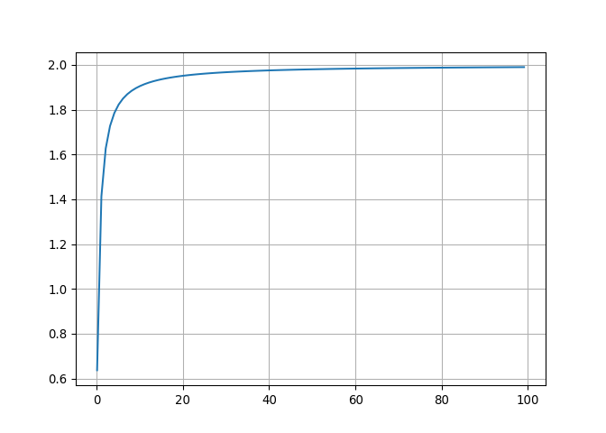
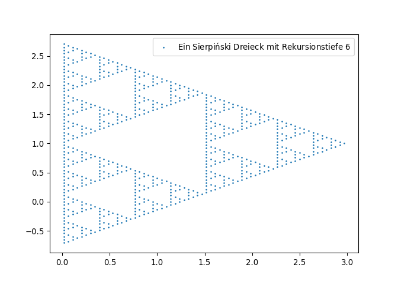
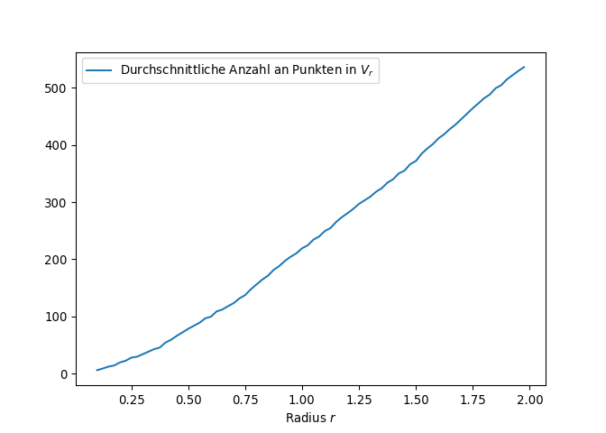
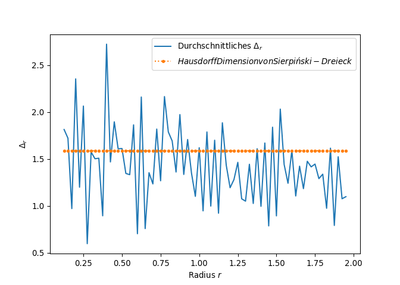

### Einleitung in die Theorie

Vor einigen Tagen bin ich auf den Artikel [Finally We May Have a Path to
the Fundamental Theory of Physics... and It's
Beautiful](https://writings.stephenwolfram.com/2020/04/finally-we-may-have-a-path-to-the-fundamental-theory-of-physics-and-its-beautiful/)
von [Stephen Wolfram](https://www.stephenwolfram.com/), einem
amerikanischen Wissenschaftler und Erfinder von
[WolframAlpha](https://www.wolframalpha.com/) gestoßen.

In seinem Artikel geht es um seine neue Theorie der Physik, welche auf
gerichteten Graphen und deren Veränderungen unter der Auswirkung von
Regeln aufbaut. Für genauere Infos ist hier die ganze Version:
[www.wolframphysics.org/technical-introduction/](https://www.wolframphysics.org/technical-introduction/)

Unter anderem werden durch seine Theorie mathematische Räume aus Graphen
gebildet. Also Knoten welche untereinander vernetzt sind.

### Auswirkung auf Dimensionalität

Nun bildet sich die Frage, was uns dies über die Dimensionalität von
Räumen sagen kann.

Vieles zu diesem Thema kann man [in dem Artikel
durchlesen](https://writings.stephenwolfram.com/2020/04/finally-we-may-have-a-path-to-the-fundamental-theory-of-physics-and-its-beautiful/#23_out).
Doch kurz zusammengefasst, kann man mittels dieser Graphen die Dimension
eines Raumes generallisieren. Diese Generallisierung kann man dann sogar
auf andere mathematische Objekte ausdehnen, sodass man den
Dimensionsbegriff generell erweitern kann. Somit wird es uns möglich,
auch über "2.5"-Dimensionalen Raum zu reden, oder auch
"$$\pi$$"-Dimensionale Räume zu betrachten.

### Meine ersten Ideen

Zuerst war es für mich recht kompliziert, diesen Begriff für metrische
Räume zu übersetzen. Doch im Endeffekt waren die Formeln eigentlich die
selben, nur habe ich es mir selber unnötig kompliziert gemacht, indem
ich selber noch herumgeforscht habe:

<blockquote class="imgur-embed-pub" lang="en" data-id="a/3yjeSPI"><a href="//imgur.com/a/3yjeSPI">Meine Ideen zum Dimensionsbegriff</a></blockquote><script async src="//s.imgur.com/min/embed.js" charset="utf-8"></script>

### Wie funktioniert dieser Dimensionsbegriff?

Betrachte folgende Graphen:

-   
-   

Beide stellen da, wie sich Sphären in einem Gitter ausbreiten. Das wird,
so Herr Wolfram folgender Maßen gebildet: "Start at some point in the
hypergraph. Then follow $$r$$ hyperedges in all possible ways. You've
effectively made the analog of a "spherical ball" in the
hypergraph.\"[^1]

Nun kann man für beliebige Graphen einen Punkt wählen, und Zählen, wie
viele Punkte in $$r$$ Schritten oder weniger erreichbar sind. Sollte
diese Ausbreitung der eines Polynoms ähnlich sein, so kann man anhand
des Grades dessen die Dimension bestimmen. Das genaue bestimmen ist
jedoch nicht trivial und wird im Kapitel 4.6 vom Wolfram Physics
Project[^2] genauer erklärt[^3] [^4]

### Berechnung der Dimension

##### Hinweis

In dem Folgenden wird eine von mir entwickelte Version betrachtet,
welche an das
[Original](https://www.wolframphysics.org/technical-introduction/limiting-behavior-and-emergent-geometry/the-notion-of-dimension/)
nur angelehnt ist.

##### Berechnung

Sei $$ (M,d) $$ ein metrischer Raum.

-   $$M$$ ist Menge
-   $$d: M\times M \rightarrow \mathbb{R}_{\ge 0}$$ ist eine Metrik

Sei $$V_{r,x} = |\{y \in M \mid d(x,y) \le r\}|$$ die Anzahl aller
Punkte eines Balles mit Radius $$r$$.

Sei
$$\Delta_{r,x} = \frac{\log(V_{r+1,x})-\log(V_{r,x})}{\log(r+1)-\log(r)} = \frac{\log\frac{V_{r+1,x}}{V_{r+1,x}}}{\log{\frac{r+1}{r}}}$$.

Nun gilt folgendes:

$$
\text{dim}(M,d) = \begin{cases}
    \lim_{r\rightarrow \infty}\Delta_{r,x} & \text{wenn}\> |M|\ge\infty \wedge |V_{r,x}|<\infty\\
    \lim_{r\rightarrow \infty}\Delta_{r,x} & \text{(?) wenn}\> |M|\ge\infty \wedge |V_{r,x}|\ge\infty\\
    \begin{gather}
    v\in\mathbb{R}_{\ge 0} \text{ mit } \\
    |\{\Delta_{v\pm\epsilon,x}\}| = \max |\{\Delta_{w\pm\epsilon,x}\}|\\
    \forall \epsilon,w\in\mathbb{R}_{\ge 0}
    \end{gather} & \text{wenn}\> |M|<\infty
\end{cases}
$$

##### Beispiel 1

$$
\begin{aligned}
    M      & = \mathbb{Z} \\
    d(x,y) & = |x+y| \\
    V_{r,x}& = 2r \\
    \Delta_{r,x} &= \frac{- \log{\left(2 r \right)} + \log{\left(2 r + 2 \right)}}{- \log{\left(r \right)} + \log{\left(r + 1 \right)}} \\
    \lim_{r\rightarrow\infty}\Delta_{r,x} &= 1
\end{aligned}
$$

Hier stimmt die Dimension offensichtlich mit der herkömmlichen
Definition überein.

##### Beispiel 2

$$
\begin{aligned}
    M      & = \mathbb{Z}^2 \\
    d(x,y) & = |x_1+y_1 + x_2+y_2| \\
    V_{r,x}& = 2r^2+2r+1 \quad\forall x\in M\\
    \Delta_{r,x} &= \frac{\log{\left(2 r + 2 \left(r + 1\right)^{2} + 3 \right)} - \log{\left(2 r^{2} + 2 r + 1 \right)}}{- \log{\left(r \right)} + \log{\left(r + 1 \right)}} \\
    \lim_{r\rightarrow\infty}\Delta_{r,x} &= 2
\end{aligned}
$$

``` python
import numpy as np
import matplotlib.pyplot as plt
V = lambda r: 2*r**2+2*r+1
Delta = lambda r: (np.log(V(r+1))-np.log(V(r)))/(np.log(r+1)-np.log(r))
xn = np.arange(0.1, 100,1)
fig, ax = plt.subplots()
ax.plot(xn, Delta(xn))
ax.grid()
plt.show()
```



Auch hier stimmen die Definitionen überein.

##### Beispiel 3

Ein Sierpiński Dreieck kann folgender Maßen gebildet werden:

``` python
import matplotlib.pyplot as plt
import numpy as np

sirp = lambda x: [[],[],[]] if x==[] else [ sirp(v) for v in x]
repeat = lambda f,x,n: f(x) if n==1 else f(repeat(f,x,n-1))
points = []
start  = np.array([1,1])
angle  = 2*np.pi/3       # Winkel zwischen Punkten
length = 1               # Anfangslänge eines Punktes zum nächsten
decay  = 0.5             # Koeffizient, mit dem bei jeder Iterationstiefe die Länge zwischen Punkten sinkt
def calc(data, current_point=start, length=length):
    if len(data)==0:
        points.append(current_point)
    for i in range(len(data)):
        newpoint = current_point+np.array([
            length * np.cos(angle * i),
            length * np.sin(angle * i),
        ])
        calc(data[i], newpoint, length*decay)

# Sierpiński Dreieck mit Rekursionstiefe rt
rt = 6
data = repeat(sirp, [], rt)
calc(data)

# Zeichnen
x, y = np.array(points).T
fig, ax = plt.subplots()
ax.scatter(x, y, s=1)
plt.legend(['Ein Sierpiński Dreieck mit Rekursionstiefe $'+str(rt)+'$'])
plt.show()

# Nun berechnen wir V_r für jeden Punkt für verschiedene r
```



``` python
rn = np.arange(0.1,2,0.025)
d = np.hypot
U = lambda r,p: [ q for q in points if d(*(p-q))<=r ]
V = lambda r,p: len(U(r,p))
def avg(r):
    """berechne die durchschnittliche Anzahl an Punkten in einer r großen Umgebung
    """
    total = 0
    for p in points:
        total += V(r,p)
    total /= len(points)
    return total

val = [avg(r) for r in rn]
fig, ax = plt.subplots()
ax.plot(rn, val)
plt.xlabel('Radius $r$')
plt.legend(['Durchschnittliche Anzahl an Punkten in $V_r$'])
plt.show()

# Delta berechnung
```



``` python
dn = [rn[i] for i in range(1,len(rn)-1)]
Delta = lambda i: (np.log(val[i+1])-np.log(val[i]))/(np.log(rn[i+1])-np.log(rn[i]))
dval = [Delta(i) for i in range(len(dn))]

fig, ax = plt.subplots()
ax.plot(dn, dval)
ax.plot(dn, [np.log2(3) for _ in dn], '.:')
plt.xlabel('Radius $r$')
plt.ylabel('$\Delta_r$')
plt.legend(['Durchschnittliches $\Delta_r$', '$Hausdorff Dimension von Sierpiński-Dreieck\approx\log_2(3)$'])
```



Dies bewegt sich nahe der [Hausdorff
Dimension](https://de.wikipedia.org/wiki/Hausdorff-Dimension) von einem
Sierpiński-Dreieck und zeigt, dass diese Methode genereller ist, als
die Bestimmung der Dimension, wie sie in der linearen Algebra
beigebracht wird.

In den Folgenden Beiträgen, werde ich auf einige der Eigenschaften
dieses Dimensionsbegriffes eingehen. Darunter wird auch fallen, welche
Auswirkung die Dimension auf die Krümmung des Raumes hat und wie somit,
Beispielsweise Gravitation auf natürliche Weise auftaucht.

[^1]: <https://writings.stephenwolfram.com/2020/04/finally-we-may-have-a-path-to-the-fundamental-theory-of-physics-and-its-beautiful/#23_out>

[^2]: <https://www.wolframphysics.org/>

[^3]: <https://www.wolframphysics.org/technical-introduction/limiting-behavior-and-emergent-geometry/the-notion-of-dimension/>

[^4]: <https://www.wolframphysics.org/technical-introduction/limiting-behavior-and-emergent-geometry/dimension-related-characterizations/>
