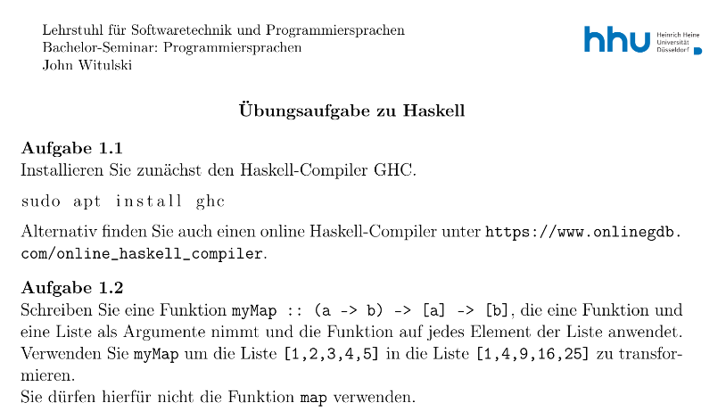
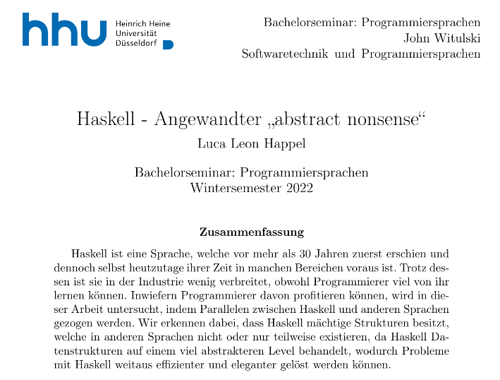

## Einleitung

Dieses Semester habe ich einen Kurs in der Heinrich-Heine Universität
in Düsseldorf belegt, welcher sich mit verschiedenen Programmiersprachen
beschäftigte. Dabei habe ich einen Vortrag über Haskell gehalten, welche
eine Sprache ist, die mir sehr am Herzen liegt.
Zu dem Seminar gehörte es, einen Vortag über 45 Minuten zu halten,
zusammen mit dem Design eines Übungsblattes,
welches die erlernten Fähigkeiten in 30 Minuten testen sollte. Außerdem
sollte eine Ausarbeitung, welche im Umfang einer Bachelorarbeit war,
angefertigt werden und es sollten zwei Rezensionen zu den angefertigten
Bachelorarbeiten anderer Studienrenden angefertigt werden.

Das Resultat ist meiner Meinung nach bei mir sehr gut ausgefallen, weshalb
ich es hier teile:

### Vortrag

<iframe width="560" height="315" src="https://www.youtube.com/embed/b5qCzC3HnJc" title="YouTube video player" frameborder="0" allow="accelerometer; autoplay; clipboard-write; encrypted-media; gyroscope; picture-in-picture; web-share" allowfullscreen></iframe>

### Übungsaufgaben:

- [Aufgaben](https://github.com/Quoteme/bachelor_seminar_haskell/blob/master/aufgaben/Vorlagen/Uebung.pdf)
- [Musterlösungen](https://github.com/Quoteme/bachelor_seminar_haskell/blob/master/aufgaben/musterloesung.hs)

# Ausarbeitung im Umfang einer Bachelorarbeit:

[Ausarbeitung: Haskell - Angewandter „abstract nonsense“](https://github.com/Quoteme/bachelor_seminar_haskell/blob/master/ausarbeitung/article.pdf)
