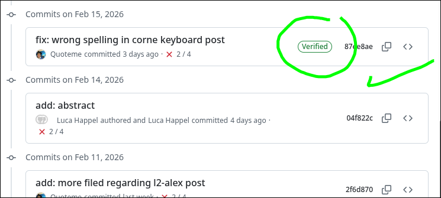

## Installation

I am on NixOS, and I wish to install Bitwarden, using flatpak. I can do this by
running the following command:

```{bash}
flatpak install flathub com.bitwarden.desktop
```

Now, one you have launched Bitwarden, you can create an account and set up your vault.
Once you have done that, you can generate a new SSH key in your Bitwarden
vault (vault is another word for the storage in your Bitwarden account).

In Bitwardens settings, check "Activate SSH Agent". Optionally check the
"Automatically start Bitwarden on system startup" option, so that you don't have
to manually start it.

## Setting up the SSH agent

Put this line in your `.bashrc` or `zshrc`:

```{bash}
export SSH_AUTH_SOCK="$HOME/.var/app/com.bitwarden.desktop/data/.bitwarden-ssh-agent.sock"
```

If you have installed Bitwardern natively, you may need to specify a different
path for the `SSH_AUTH_SOCK` variable, like this:

```{bash}
export SSH_AUTH_SOCK="$HOME/.bitwarden-ssh-agent.sock"
```

## Setting up Git


Now, paste this into your terminal:

```{bash}
git config --global gpg.format ssh
git config --global user.signingkey "<YOUR_PUBLIC_KEY>"
# replace <YOUR_PUBLIC_KEY> with the public key you generated in Bitwarden
# e.g. : ssh-ed25519 AAAAC3Nz... comment
git config --global commit.gpgsign true
git config --global tag.gpgsign true
mkdir -p ~/.config/git
echo "$(git config --get user.email) namespaces=\"git\" <YOUR_PUBLIC_KEY>" \
  >> ~/.config/git/allowed_signers
# replace <YOUR_PUBLIC_KEY> with the public key you generated in Bitwarden
# e.g. : ssh-ed25519 AAAAC3Nz... comment
```

## Setting up GitHub

Finally, you need to add your public key to GitHub. You can do this by going to
[https://github.com/settings/keys](https://github.com/settings/keys) and
adding your public key there.


## Verfify setup

Finally, push a new commit to github. Check if there are "verified" badges to
your commits. If so, you have successfully set up commit signing with Bitwarden!


