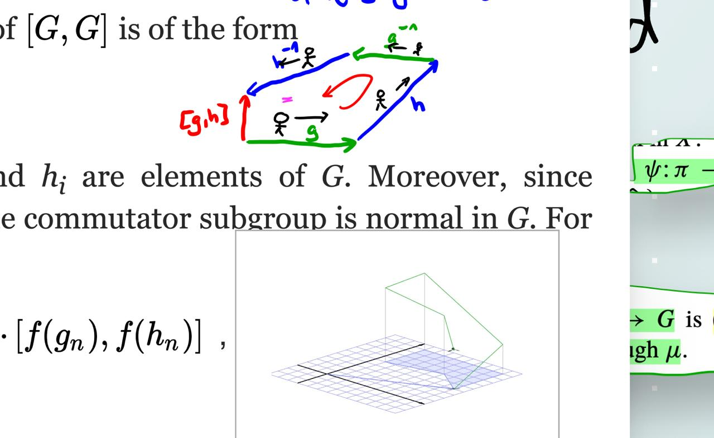
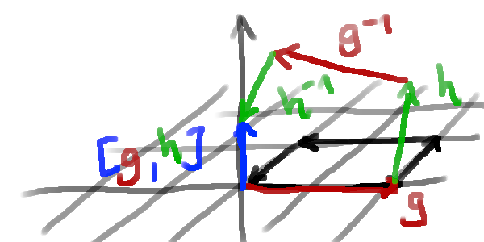
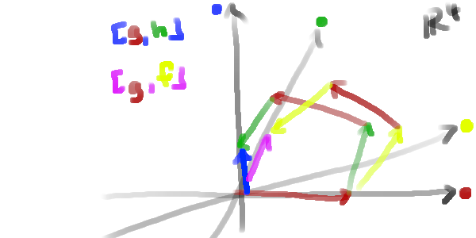
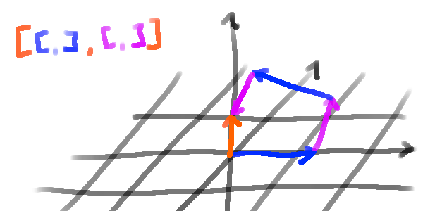

Given a group $G$, the commutator $[G,G]$ is defined as

$$
\begin{align*}
\text{span} \{ [g,h] \} = \text{span} \{ ghg^{-1}h^{-1} \}
\end{align*}
$$

Let us consider $G$ as a "space" of a videogame, in which a player may move
around in. The players position is then given by an element $p \in G$.
Assume that $G$ is finitely generated by a set of generators $S$.
Then the player can move around in $G$ by applying the generators to their position. 
For example, if $s \in S$ is a generator, then the player can move from position $p$
to position $ps$.
I have visualized this idea previously on my Instagram account: 
[https://www.instagram.com/stories/highlights/17907335377797682/](https://www.instagram.com/stories/highlights/17907335377797682/)

<video width="200px" controls><source src="./algebraland.mov"></video>

It might so happen that when a player moves in a circle, that he does not end up
at the place location at which he started:

The commutator subgroup detects all these displacements (here shown in blue):

We can iterate this process and look at the commutator of the commutator, and so
on. This gives us the *derived series* of a group:

$$
\begin{align*}
G^{(0)} &= G \\
G^{(1)} &= [G,G] \\
G^{(2)} &= [G^{(1)}, G^{(1)}] \
&\vdots
\end{align*}
$$

Which we can also visualize as follows:

---

I am unsure if this is actually deeply connected or not, but I came across this
idea while watching this YouTube video by Zeno Rogue:


