Covering spaces are a fundamental concept in topology.
Some typical examples can be seen [in this previous post](../l2-invariants/).

:::{#def-covering-space .definition}
A **covering space** of a topological space $X$ is a topological space $C$ together with a continuous surjective map $p: C \to X$ such that for every point $x \in X$, there exists an open neighborhood $U$ of $x$ such that $p^{-1}(U) \cong F \times U$ for some discrete set $F$ (called the fiber over $x$), and the map $p$ restricted to each component of $p^{-1}(U)$ is a homeomorphism onto $U$.
:::

{width="33%"}

:::{#def-universal-cover .definition}
A **universal cover** of a topological space $X$ is a covering space $\tilde{X}$ of $X$ that is simply connected, meaning that it has no nontrivial loops. The universal cover is unique up to homeomorphism and serves as a "universal" object in the category of covering spaces of $X$.
:::

## The universal cover of a doughnut

A filled torus (a doughnut) is a surface of genus 1.
There exists a deformation retract from the doughnut to a circle, so the fundamental group of the doughnut is $\pi_1(T^2) \cong \mathbb{Z}$.

But what does any of that even mean? Let's visualize the universal cover of the doughnut.
Let us start with Bob, who lives in the following little world:

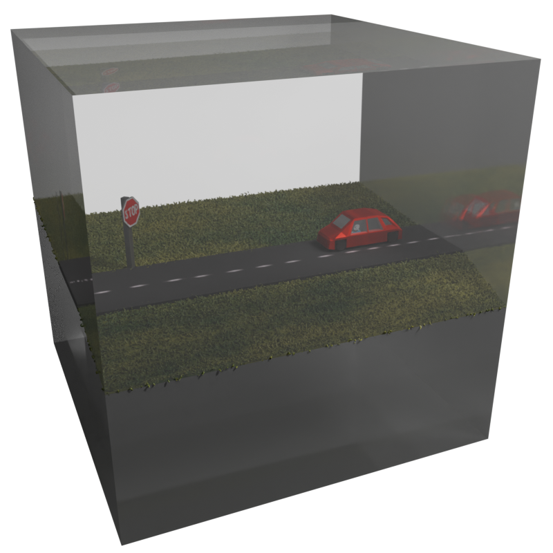{width="33%" group="bob"}

When Bob drives along the road past the stop sign, he will eventually return to the same point at which he started. However, he would reach invisible walls, it he intended to walk along the grass, or jump to the sky. The road is the only way to get around, and it loops back on itself.

Topologically, Bobs world is a doughnut, and the road is a loop around the hole of the doughnut. If we were to stretch it (don't worry, this wont harm Bob, he does not even notice!), we would get the following picture:

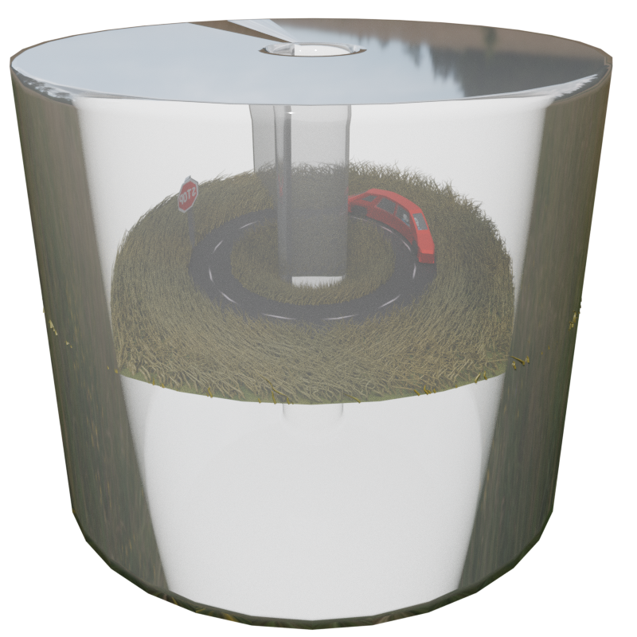{width="33%" group="bob"}

These kinds of worlds typically occur in video games, and famously the ideas which I will elaborate on in this post were used in the Super Mario 64 community to "hack" the game to achieve various speedrunning goals: 



(This is where the famous "but first, we will need to talk about parallel universes" quote comes from. In the SM64 community, covering spaces are known as "parallel universes"). Weather intentional (like in Pacman) or unintentional (like in Super Mario 64, due to floating point arithmetic), it is often the case that walking in a straight line long enough will eventually lead you back to the same point.

In the case of SM64 however, only the collision detection code is affected by this floating point arithmetic, but not the rendering engine. So there actually are some differences between the "parallel universes" in SM64. In particular, when Mario moves to a different parallel universe, the same collisions are still detected, although he is rendered as floating in an empty space. We can encode this also in Bobs world:

Lets assume, we would double, triple, quadruple, etc. Bobs world and stack these copies on top of each other. Bob would never notice, as long as each copy is just a "shallow" copy, meaning that each movement in the _fundamental domain_ (the original world) is mirrored in the copies. In this case, we would have a covering space of Bobs world, and the original world would be the base space.

:::{layout-ncol="3"}
{group="bob"}

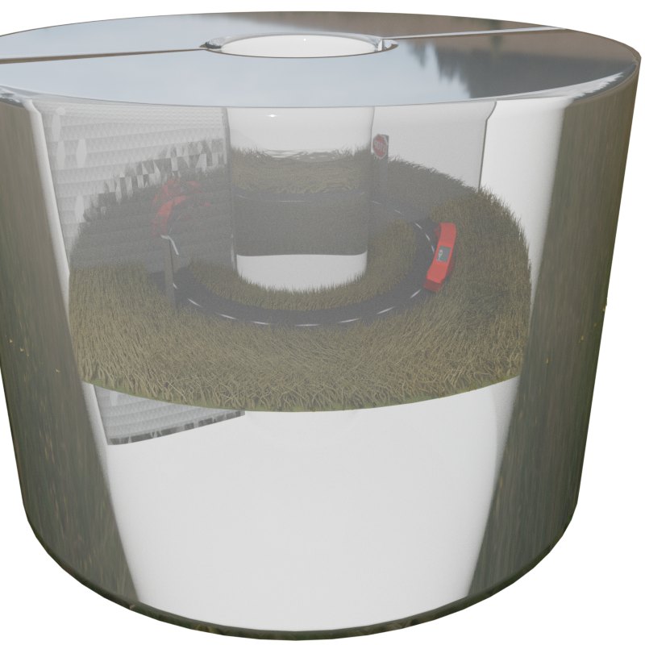{group="bob"}

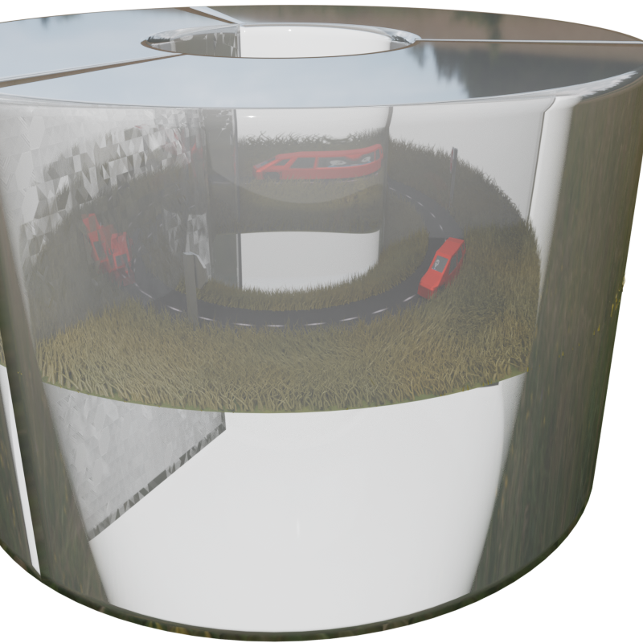{group="bob"}
:::

You could now imagine if we would do the same for SM64. Only there, we would not render any of the terrain, but only Mario himself for the copies.

If we were to keep stacking these copies, we would get the following picture:

:::{layout-ncol="2"}
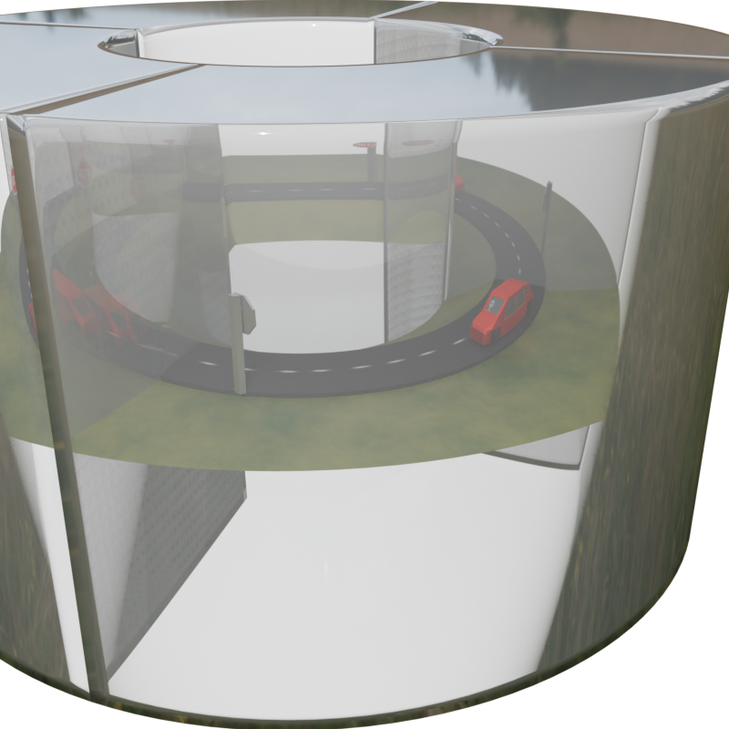{group="bob"}

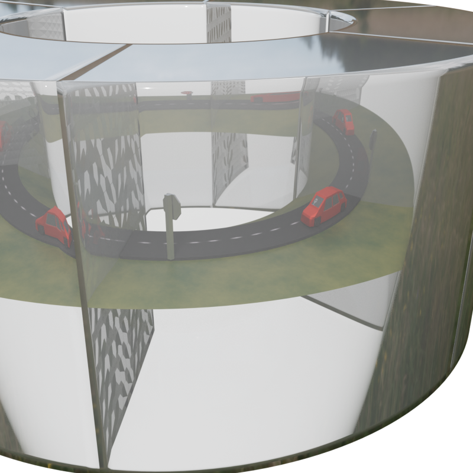{group="bob"}

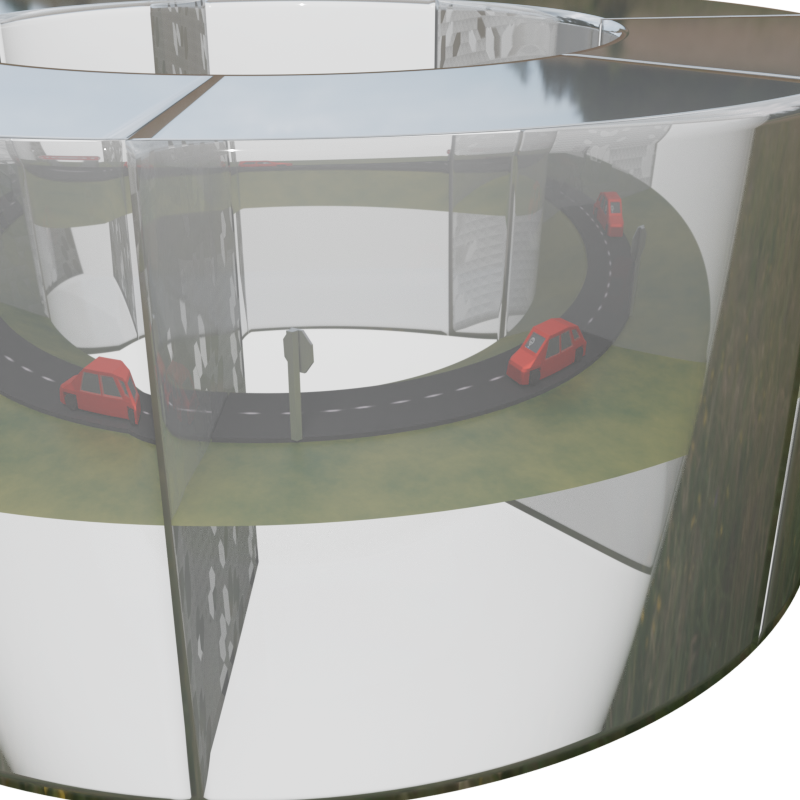{group="bob"}

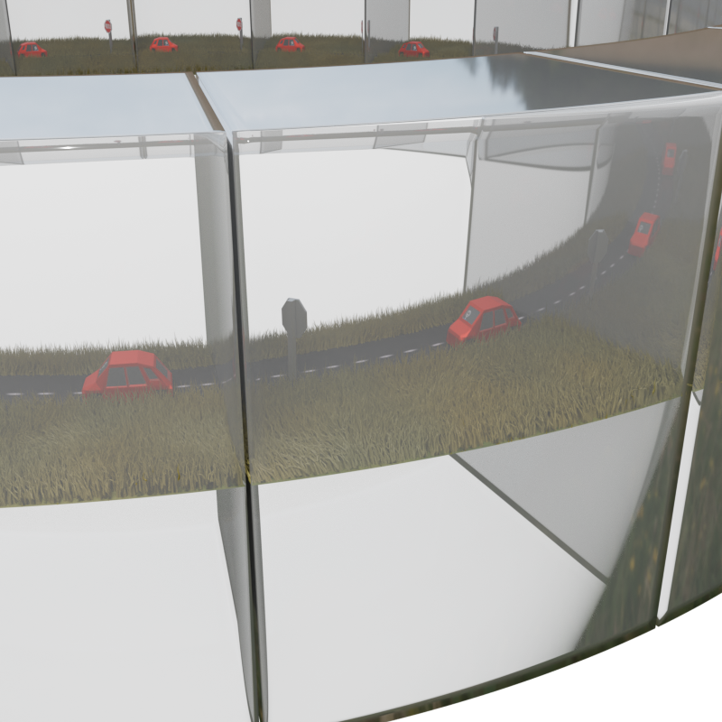{group="bob"}

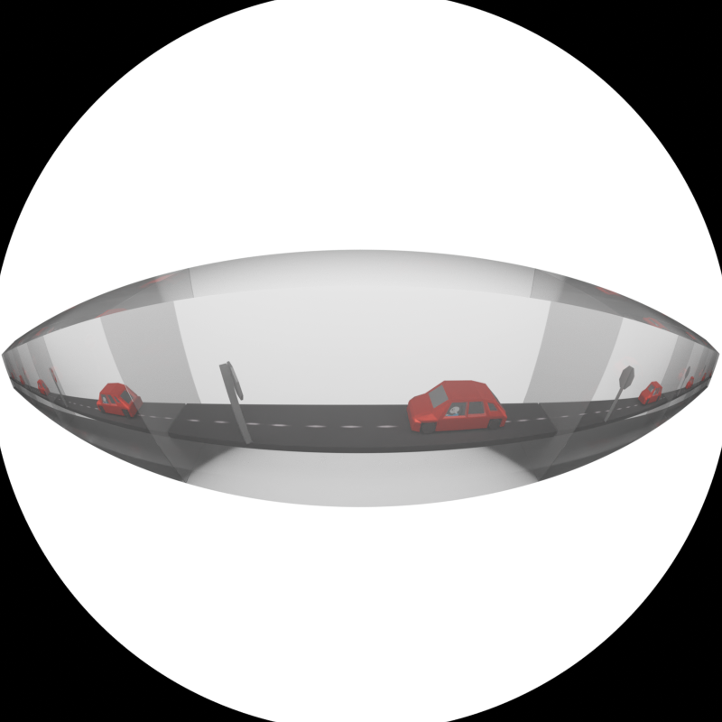{group="bob"}
:::

:::{.callout-caution}
I sometimes changed the ground texture and was too lazy to rerender all the images, so please excuse this inconsistency in the images.
:::

### Further elabotrtion regarding Super Mario 64

This is actually what [Bismuth](https://www.youtube.com/@Bismuth9) describes in [his video: "Super Mario 64 Tool-assisted speedrun world record explained"](https://www.youtube.com/watch?v=wjge1bVobN0) in the case of the $T^3$, the world of SM64. The $T^3$ is the 3-dimensional torus, which is the product of three circles. Look at this short clip from his video:

<table style="border:1px solid var(--bs-border-color); border-radius:6px; overflow:hidden; flex:1;">
  <tr>
    <td style="padding:0;">
      <video controls style="width:100%; display:block;">
        <source src="/assets/covering-space/sm64-bismuth-world-record.webm" type="video/webm">
        Your browser does not support the video tag.
      </video>
    </td>
  </tr>
  <tr>
    <td style="text-align:center; padding:0.4rem;">
      The world of Super Mario 64 is more or less a 3-dimensional torus $T^3$.
      Marios position is stored as a float, but cast down to a short for the collision detection, meaning that only values up between $-32768$ and $32767$ are actually detected as different positions for the collision detection. Therefor marios position detection is calculated in $B:= (\mathbb{R}/65536\mathbb{Z})^3$, and his actual position is calculated in $P:=(\mathbb{R} / (1.17549435 \times 10^{-38})\mathbb{Z})^3$,
      here we still need to mod out, because of Nintendo 64 IEEE‑754 floating point arithmetic.
    </td>
  </tr>
</table>

Casting from `float` to `short` gives rise to the retraction $\rho: P \to B$ and its section $\sigma: B \to P$ which lifts $(0,0,0)$ to $(0,0,0)$,  is exploted in SM64 speed running. In particular $P$ is a covering space of $B$ with fiber $F:= \ker(\rho)$, which are all points, where Mario transitions from one "parallel universe" to the next.

In SM64 this covering space structure is used by giving Mario extremely high velocity $v$ (a tangent vector at Marios position in $P$). The exponential map is then used to move Mario along the geodesic $\exp_p(tv)$ for $t \in \mathbb{R}$. But due to hardware limitations, only discrete steps $t_1, \dots, t_k$ for some $k in \mathbb{N}$ of this geodesic are actually calculated for collision detection. [More on how this is related to the exponential map of Lie groups can be found in my previous post.](../lie-groups-and-algebras/)

By carefully choosing Marios position $p in P$ and velocity $v in T_p P$, the SM64 community was able to reach a desired positions $q$ in $B$ up to collision detection (for reaching some door, collecting a star, etc.). They did this by checking which $t_1, \dots, t_k$ SM64 actually uses for calculations and then making the right choices, so that $\rho(\exp_p(tv_i)) = q$ for some $i$ and for all other $j \neq i$ $\rho(\exp_p(tv_j))$ is not a position that would trigger a collision detection with negative consequences (like resetting $v$).

s Video](/assets/covering-space/parallel_universes_sm64.png){width="33%"}

## Hyperbolic geometry from the universal cover $\widetilde{S^1 \vee S^1}$

In the previous example we considered a space which has only one road looping back on itself.
The number of times you would walk around the road to get back to the "same" point (or an equivalent point in a different copy) can be encoded using this "winding number" trick:

Assume Bob had a dog "Snoopy" on a leash and it walks along the road, while Bob was standing still. If the dog follows the road once and comes back to Bob, this results in the leash being wrapped around the hole in his space: In other words, Bob would need to walk around the hole once to untangle it.

In fact, we could encode in which copy of Bobs world Snoopy is, by counting how many times the leash is wrapped around the hole.

This "wrapping a leash around the hole" action that Snoopy can perform is actually a [group action](https://en.wikipedia.org/wiki/Group_action) of $\mathbb{Z}$ on the base space (Bobs space): For each integer $n \in \mathbb{Z}$, Snoopy can wrap the leash around the hole $n$ times, and $n-m$ corresponds to Snoopy walking around the hole $n$ times clockwise and then $m$ times counterclockwise.

:::{.callout-note collapse="true"}
:::{#def-fundamental-group }
## Definition: Fundamental Group

Let $X$ be a topological space and $x_0 \in X$ a basepoint. A **loop** based at $x_0$ is a continuous map $\gamma: [0,1] \to X$ with $\gamma(0) = \gamma(1) = x_0$. Two loops $\gamma, \delta$ are **homotopic relative to $x_0$** (written $\gamma \simeq \delta$) if there exists a continuous map $H: [0,1] \times [0,1] \to X$ such that
$$H(s,0) = \gamma(s), \quad H(s,1) = \delta(s), \quad H(0,t) = H(1,t) = x_0$$
for all $s,t \in [0,1]$. This is an equivalence relation; denote the equivalence class of $\gamma$ by $[\gamma]$.

The **fundamental group** of $X$ at $x_0$ is
$$\pi_1(X, x_0) \;:=\; \bigl\{[\gamma] \mid \gamma \text{ is a loop based at } x_0\bigr\}$$
equipped with the group operation of *concatenation*:
$$[\gamma] \cdot [\delta] := [\gamma * \delta], \qquad (\gamma * \delta)(s) := \begin{cases} \gamma(2s) & s \in [0,\tfrac{1}{2}] \\ \delta(2s-1) & s \in [\tfrac{1}{2},1] \end{cases}$$
The identity element is the class of the constant loop $[c_{x_0}]$, and the inverse of $[\gamma]$ is $[\bar\gamma]$ where $\bar\gamma(s) := \gamma(1-s)$.

If $X$ is path-connected, the isomorphism type of $\pi_1(X,x_0)$ is independent of the basepoint $x_0$, and we write simply $\pi_1(X)$.
:::
:::

If we would think of the invisible walls in Bobs world as actual walls, say by a street lamp, we would get the following picture:

::::{layout-ncol="4"}
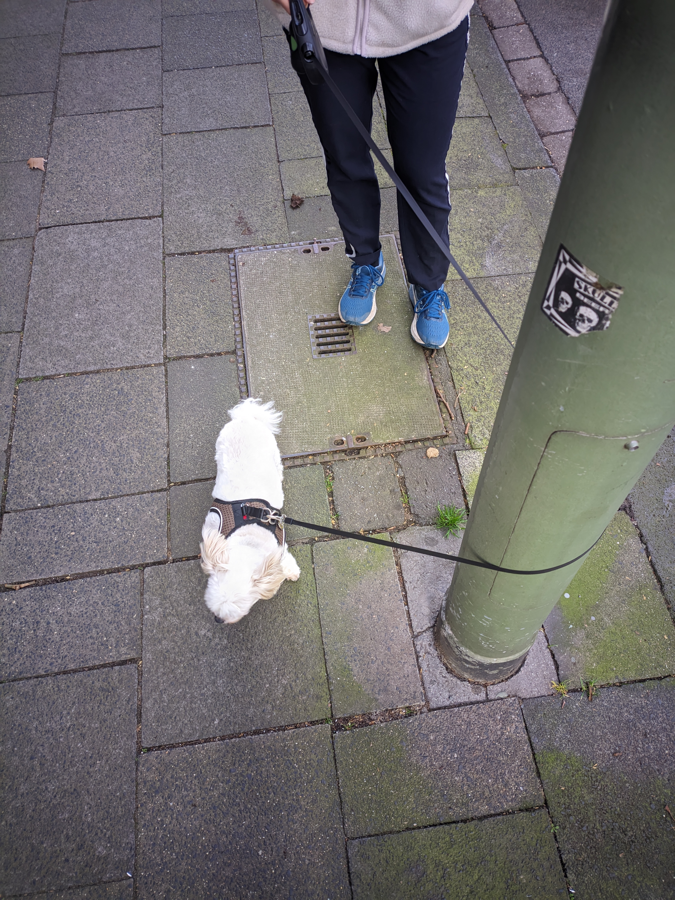{group="snoopy"}

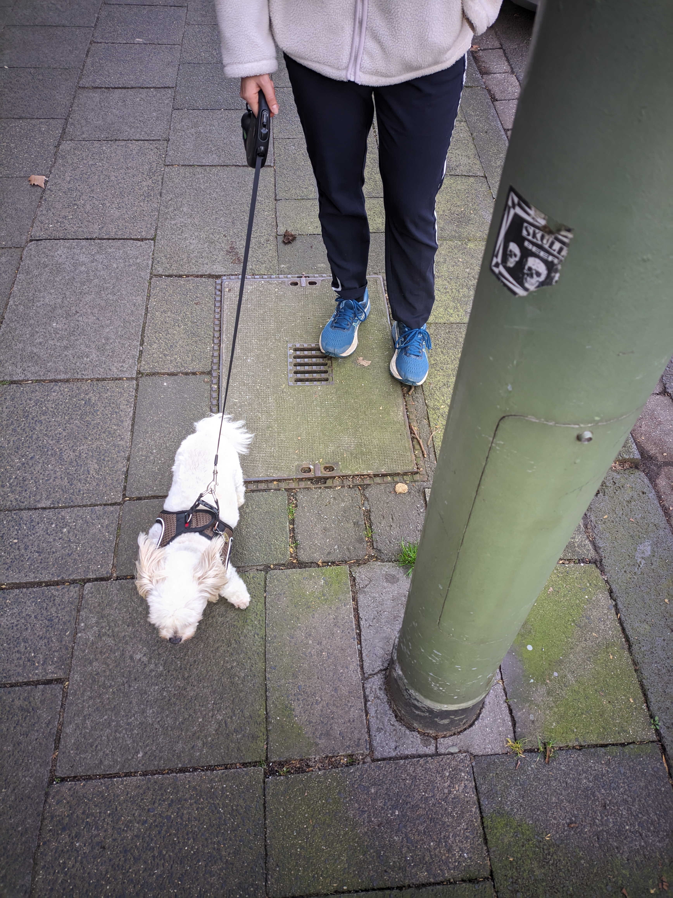{group="snoopy"}

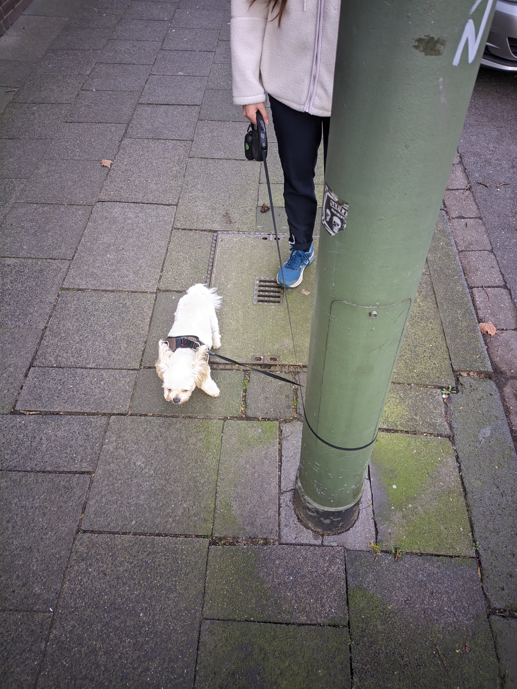{group="snoopy"}

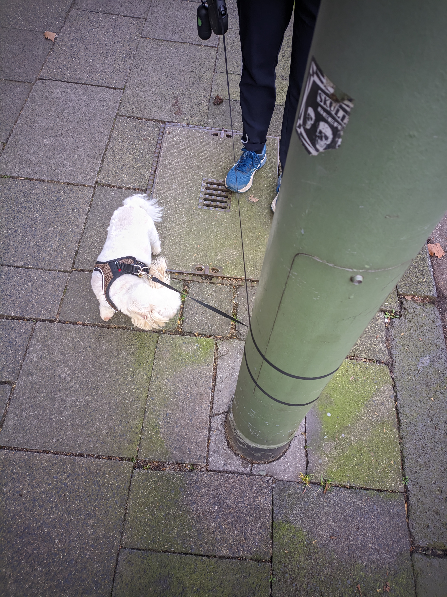{group="snoopy"}
:::

So we have that one line removed in Bobs space results in an infinite ($\mathbb{Z}$) amount of copies in the universal cover, but what is we would remove two lines?

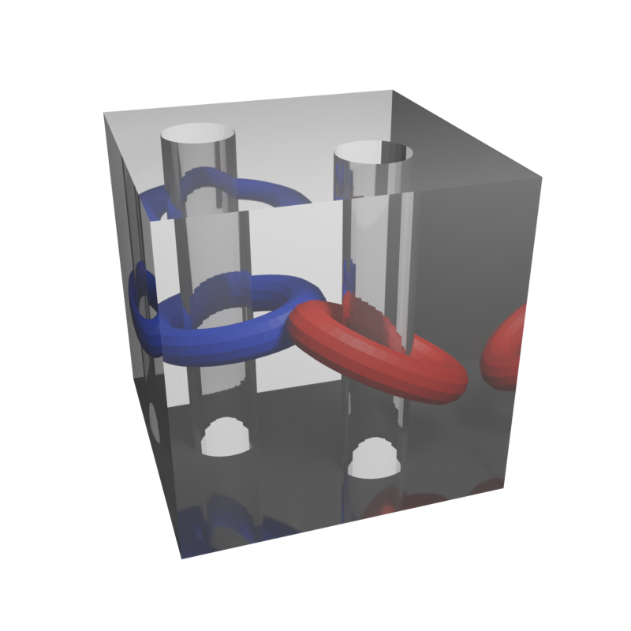{width="33%" group="bob"}

Let's "unfold" this world again, like we did with the torus and the world, where moving through the wall along the road "teleported" Bob back to the other side.
I will place a small house and some water into this barren world, so bob can have a nice place to live:

<table style="border:1px solid var(--bs-border-color); border-radius:6px; overflow:hidden; flex:1;">
  <tr>
    <td style="padding:0;">
      <video autoplay loop muted style="width:100%; display:block;">
        <source src="/assets/double-torus-unfold.webm" type="video/webm">
        Your browser does not support the video tag.
      </video>
    </td>
  </tr>
  <tr>
    <td style="text-align:center; padding:0.4rem;">
      Unfolding the space with two lines removed (Bobs home) to a double doughnut.
    </td>
  </tr>
</table>

:::{.callout-warning}
This is __not__ the space where Super Mario 64 takes place! SM64 would be the space $T^3$ (a 3-dimensional torus). We would get this space by removing putting portals from the left to the right, from the top to the bottom and from the floor to the ceiling in a box, which was Bobs road-trip world from before!
:::

In this double dougnut world, the fundamental group would be the free group on two generators:

{width="33%" group="bobs_home"}

And if we form the universal cover of this space, we get the following hyperbolic space (notice that I shrinked copies the the base space/"parallel universes"), because hyperbolic space does not fit into the Euclidean plane:

:::{layout-ncol="2"}
{group="bobs_home"}

{group="bobs_home"}
:::

---

Further references:



I drew _heavy inspiration_ from this video "Not Knot" by the Geometry Center / Geometry Supercomputer Project in 1991, directed by Charlie Gunn and Delle Maxwell.