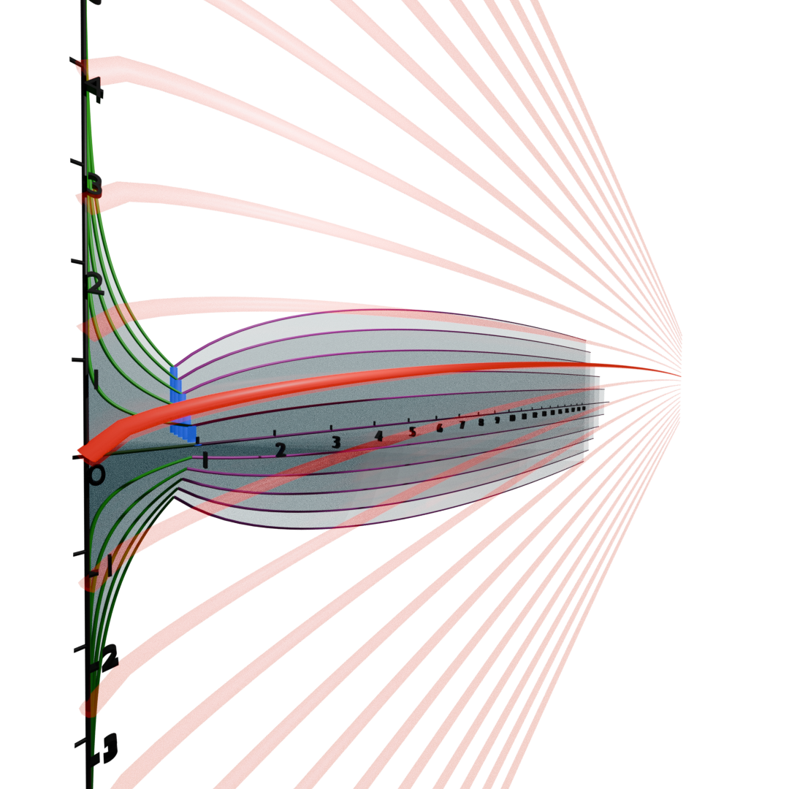
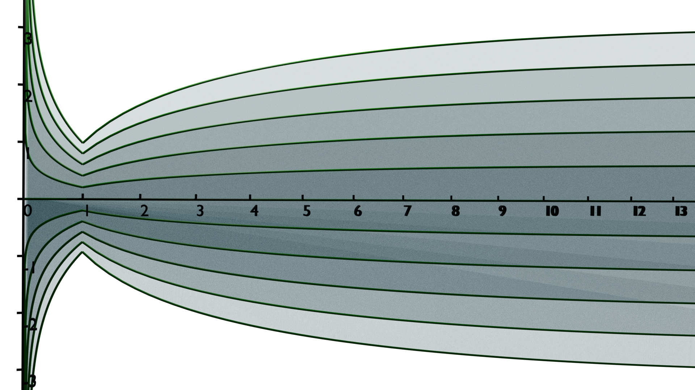
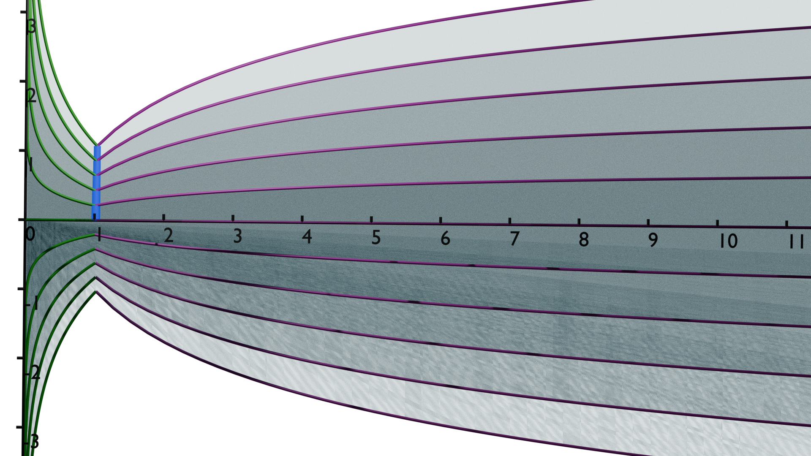

::: {.callout-warning}
Not finished yet...

Most of the screenshots of definitions/theorems are taken from:

- Introduction to 3-manifolds by Wolfgang Lück at Bonn Germany
:::

My masters thesis is about the following statement from the 
2019 paper "The $L^2$-torsion function and the Thurston norm of 3-manifolds"
by Friedl and Lück:

# The main theorem

> **Theorem 5.1** (Main theorem). Let $M$ be an irreducible 3-manifold with infinite fundamental group $\pi$ which is not a closed graph manifold and not homeomorphic to $S^1 \times D^2$. Let $\mathfrak{s} \in \mathrm{Spin}^c(M)$ and write $\pi = \pi_1(M)$.
> 
> Then there exists a $(H_1)_f$-factorizing epimorphism $\alpha\colon \pi \to \Gamma$ to a virtually finitely generated free abelian group such that the following holds: For any $\phi \in H^1(M; \mathbb{Q})$ and any factorization of $\alpha\colon \pi \to \Gamma$ into group homomorphisms $\pi \xrightarrow{\mu} G \xrightarrow{\nu} \Gamma$ for a residually finite countable group $G$, there exists a real number $D$ depending only on $\phi$ but not on $\mu$ such that for $t \leq 1$
> 
> $$\tfrac{1}{2}\bigl(\phi(c_1(\mathfrak{s})) + x_M(\phi)\bigr)\ln t - D \;\leq\; \rho^{(2)}(M, \mathfrak{s}; \mu, \phi)(t) \;\leq\; \tfrac{1}{2}\bigl(\phi(c_1(\mathfrak{s})) + x_M(\phi)\bigr)\ln t$$
> 
> and such that for $t \geq 1$
> 
> $$\tfrac{1}{2}\bigl(\phi(c_1(\mathfrak{s})) - x_M(\phi)\bigr)\ln t - D \;\leq\; \rho^{(2)}(M, \mathfrak{s}; \mu, \phi)(t) \;\leq\; \tfrac{1}{2}\bigl(\phi(c_1(\mathfrak{s})) - x_M(\phi)\bigr)\ln t.$$
> 
> In particular we get
> 
> $$\deg\bigl(\rho(M, \mathfrak{s}; \mu, \phi)\bigr) = -x_M(\phi).$$

Let us first unravel what this theorem really means step by step.
Here are the terms we need to understand:

- The 3-manifold $M$ is
  - irreducible
  - has infinite fundamental group
  - is not a closed graph manifold
  - is not homeomorphic to $S^1 \times D^2$
- $\mathfrak{s} \in \text{Spin}^c(M)$ is a spin structure on $M$.
- $\alpha\colon \pi \to \Gamma$
  - is an epimorphism (surjective group homomorphism)
  - is $(H_1)_f$-factorizing, which means that $\alpha$ factors through the free part of the first homology group $H_1(M)_f $
  - $\Gamma$ is a virtually finitely generated free abelian group 
- $\phi \in H^1(M; \mathbb{Q})$ is a rational cohomology class on $M$.
- $\mu : \pi \to G$ is a group homomorphism to a residually finite countable group $G$.
  - A group $G$ is [residually finite](https://en.wikipedia.org/wiki/Residually_finite_group) (aka finitely approximable) if for every non-identity element $g \in G$, there exists a finite index normal subgroup $N \triangleleft G$ such that $g \notin N$. Intuitively, this means that the group can be approximated by its finite quotients.
- $\rho^{(2)}(M, \mathfrak{s}; \mu, \phi)(t)$ is the $L^2$-torsion function associated to $M$, $\mathfrak{s}$, $\mu$, and $\phi$ evaluated at $t$.

## The manifold $M$

Lets inspect the first requirements:

> Let $M$ be an __irreducible__ 3-manifold with __infinite fundamental group__ $\pi$ which is not a __closed graph manifold__ and not homeomorphic to $S^1 \times D^2$. Let $\mathfrak{s} \in \mathrm{Spin}^c(M)$ and write $\pi = \pi_1(M)$.

Further up in the text the authors specify that all manifolds are __compact__,
__connected__, and __oriented__, unless otherwise specified. So $M$ must be as well.

### Irreducible

We have a definition by Friedl in "AN INTRODUCTION TO 3-MANIFOLDS"

> __The prime decomposition theorem__
> A 3-manifold $N$ is called __prime__ if $N$ can not be written as a non-trivial connected sum of two manifolds, i.e. if $N = N_1 \# N_2$, then $N_1 = S^3$ or $N_2 = S^3$. Furthermore $N$ is called __irreducible__ if every embedded $S^2$ bounds a 3-ball. Note that an irreducible 3-manifold is prime, conversely if $N$ is a prime 3-manifold, then either $N$ is irreducible or $N = S^1 \times S^2$. We now have the following theorem:

For this we need to define the connected sum of two 3-manifolds:

> Given 2-oriented 3-manifolds $N_1$ and $N_2$ we can consider the connected sum
> $$N_1 \# N_2 = (N_1 \setminus \text{3-ball}) \cup (N_2 \setminus \text{3-ball}),$$
> where we identify the two boundary spheres using an orientation reversing homeomorphism. Note that the diffeomorphism type of the

In the case of 2-manifolds, this video visualizes it well:



and for 3-manifolds (specifically $\mathbb{R}^3 \# \mathbb{R}^3$) this can be
seen as adding a wormhole between two copies of $\mathbb{R}^3$:



Or another way to look at this connected sum is by "cutting out" some region in
$N_1$ and "pasting" $N_2$ in there. We may even do this an infinite amount of
time in a checkerboard pattern, as shown here:



In this video the relevant section shows this infinite tiling where 3-manifolds
with different geometries are glued together in an alternating pattern:

:::{layout-ncol="2"}
](infinite-connected-sum-3-manifolds-tehora-rogue.png){group="screenshots" fig-align="left"}
:::

So being irreducible means either of the following equivalent conditions hold:

- every embedded $S^2$ of $M$ bounds a $D^3$.
- $M$ is prime ($M = N_1\# N_2 \implies N_1 = S^3 \text{ or }  N_2 = S^3$) or $M = S^1 \times S^2$.

### Infinite fundamental group

Aka. $\|\pi_1(M)\| = \infty$. We use this to apply the famous Thurston
geometrization theorem (these slides are from Lücks "Introduction to 3-manifolds" talk in Bonn):

:::{layout-ncol="2"}
{group="definitions" fig-align="left"}
:::

What is a "geometric toral splitting" you may ask?

:::{layout-ncol="2"}
{group="definitions" fig-align="left"}

{group="definitions" fig-align="left"}
:::

Here is a tool to play around this this definition (it only includes tori, and
no framed knots!):

<iframe width="560" height="315"
  src="https://happel.ai/jsjdecomp/"
  title="JSJDecomp" frameborder="0" allow="accelerometer;
  clipboard-write"
  allowfullscreen></iframe>

A surface $\iota : S \hookrightarrow M$ is _incompressible_, if it induces an injection
on the fundamental groups, i.e. $\pi_1(\iota) : \pi_1(S) \hookrightarrow \pi_1(M)$ is
injective. 

:::{layout-ncol="2"}
{group="jsj-steps" fig-align="left"}
:::

What could cause $\pi_1(\iota)$ to fail at being injective? 
By the Hurewicz theorem, the first homology group $H_1(S)$ is the abelianization
of $\pi_1(S)$, but for $S$ a torus, $\pi_1(S) = \mathbb{Z}^2$ is already
abelian, so $H_1(S) = \pi_1(S)$. $H_1(S)$ is generated by the 
longitude and the
meridian
of the torus, so if either of those is sent to zero by $\pi_1$, then
$\pi_1(\iota)$ cannot be injective.

:::{layout-ncol="2"}
{group="jsj-steps" fig-align="left"}
:::

Remember, that either of these loops will dissapear, if the ambient manifold $M$
contains a disk (a _compressing disk_), which will allow these loops to be
contracted to a point:

:::{layout-ncol="2"}
{group="jsj-steps" fig-align="left"}

{group="jsj-steps" fig-align="left"}
:::

Well, these disks cannot exist, iff $M$ contains some obstruction to prevent
such complressing disks.

:::{layout-ncol="2"}
{group="jsj-steps" fig-align="left"}
:::

This also explains what it means for $M$ to have "incompressible boundary":
$$
\pi_1(\partial M) \hookrightarrow \pi_1(M) \text{ is injective}
$$

This covers "disjoint" and "incompressible". What does it mean for a torus to
__not__ be __isotopic to a boundary component__?
Lets consider an example:

:::{layout-ncol="2"}
{group="jsj-steps" fig-align="center"}

{group="jsj-steps" fig-align="center"}

{group="jsj-steps" fig-align="center"}

{group="jsj-steps" fig-align="center"}
:::

As an example of a torus which is isotopic to a boundary component is given
here (for $\partial M \cong \mathbb{T}$)

:::{layout-ncol="2"}
{group="jsj-steps" fig-align="center"}
:::

#### Seifert manifolds

:::{layout-ncol="2"}
{group="seifert-manifold" fig-align="center"}

{group="seifert-manifold" fig-align="center"}
:::

Specifically, these __are Seifert manifolds__:

:::{layout-ncol="3"}

](seifert/s2r.png){group="seifert-manifold" fig-align="center"}

{group="seifert-manifold" fig-align="center"}

](seifert/h2r.png){group="seifert-manifold" fig-align="center"}

](seifert/s3.png){group="seifert-manifold" fig-align="center"}

](seifert/nil.png){group="seifert-manifold" fig-align="center"}

](seifert/sl2r){group="seifert-manifold" fig-align="center"}
:::

and these are __not seifert manifolds__:

:::{layout-ncol="3"}
](not-seifert/h3.png){group="seifert-manifold" fig-align="center"}

](not-seifert/solv.png){group="seifert-manifold" fig-align="center"}
:::

#### geometrically atoroidal

### closed

A manifold without bounadary which is compact is called *closed*, so $M$ must
have **empty boundary**.

### Graph manifolds

By Wolfang Lück's talk as mentioned above, we have this definition:

:::{layout-ncol="2"}
{group="graph-manifold" fig-align="center"}

{group="graph-manifold" fig-align="center"}
:::

And we have already inspected this under [infinite-fundamental-group](#infinite-fundamental-group)

### the spin structure $\mathfrak{s} \in \text{Spin}^c(M)$

We will not look too much into what this means. By Liu we know that omitting
this parameter in the function $\rho$ from the main theorem, we still obtain the
same asymptotic degree. In fact, omitting this parameter yields a family of
functions $[\rho] = \{\rho(t) \cdot t^r \mid \exists r \in \mathbb{R}\}$ 

This however does not change $\deg(\rho)$. For clarity though, we have

**Spin and Spin^c^.**
Here $(V, g)$ denotes a real vector space $V$ equipped with an inner product $g$, i.e., a symmetric, positive-definite bilinear form. In the setting of 3-manifolds, $V$ is typically a tangent space $T_p M$ and $g$ the Riemannian metric.

Recall that the Spin group associated to $(V, g)$ is defined by
$$\operatorname{Spin}(V) := \{ v_1 \cdots v_m \mid m \text{ even}, |v_i| = 1 \} \subset \operatorname{Cl}(V)^*,$$
where $\operatorname{Cl}(V)^*$ denotes the group of units in the Clifford algebra $\operatorname{Cl}(V)$. More generally, given a vector space $V$ over a field $K$ and a quadratic form $Q : V \to K$, the Clifford algebra is defined as the quotient algebra
$$\operatorname{Cl}(V, Q) = T(V)/I_Q,$$
where $I_Q$ is the two-sided ideal in the tensor algebra $T(V)$ generated by all elements of the form $v \otimes v - Q(v)1$ for all $v \in V$.

**Definition (Complex Spin Group, D 1.1).**
The *complex spin group* $\operatorname{Spin}^c(V)$ is the group generated by $\operatorname{Spin}(V)$ and $\mathrm{U}_1$ inside the group $\operatorname{Cl}^c(V)^*$. If $V = \mathbb{R}^n$, we write $\operatorname{Spin}^c_n := \operatorname{Spin}^c(\mathbb{R}^n)$.

Since $\mathrm{U}_1$ lies in the center of $\operatorname{Cl}^c(V)$ and $\operatorname{Spin}(V) \cap \mathrm{U}_1 = \{\pm 1\}$, it follows that
$$\operatorname{Spin}^c(V) = \operatorname{Spin}(V) \times_{\mathbb{Z}_2} \mathrm{U}_1.$$

**Definition (Spin^c^ Structure, D 2.2).**
A *spin^c^ structure* on $M$, denoted by $\sigma$, consists of a principal $\operatorname{Spin}^c_n$-bundle $P_{\operatorname{Spin}^c}(\sigma)$ together with a bundle map
$$\xi^c : P_{\operatorname{Spin}^c}(\sigma) \to P_{\mathrm{SO}}$$
which is $\operatorname{Spin}^c_n$-equivariant with respect to the homomorphism $\xi^c_0 : \operatorname{Spin}^c_n \to \mathrm{SO}_n$. The pair $(M, \sigma)$ is called a *spin^c^ manifold*.

Since $\operatorname{Spin}^c(V)$ is a double cover of Lie groups of $\operatorname{SO}(V) \times \mathrm{U}_1$, these structures can be used to describe spinor bundles.

[^double-cover]: The $L^2$-torsion function and the Thurston norm of 3-manifolds - Bohn - 2007 - An introduction to Seiberg-Witten theory on closed 3-manifolds.pdf, p158

:::{layout-ncol="2"}
{group="spinc" fig-align="center"}
:::

**The first Chern class.** The key datum attached to a Spin^c^ structure $\mathfrak{s}$ that appears in Theorem 5.1 is its *first Chern class* $c_1(\mathfrak{s}) \in H^2(M; \mathbb{Z})$. Given $\mathfrak{s}$, one forms the *determinant line bundle*
$$L(\mathfrak{s}) := P_{\operatorname{Spin}^c}(\mathfrak{s}) \times_{\operatorname{Spin}^c_3} \mathbb{C},$$
where $\operatorname{Spin}^c_3$ acts on $\mathbb{C}$ via the determinant character $[q, z] \mapsto z^2$; then $c_1(\mathfrak{s}) := c_1(L(\mathfrak{s})) \in H^2(M;\mathbb{Z})$.

For a closed oriented 3-manifold $M$, Spin^c^ structures always exist (since $w_2(M) = 0$ for all orientable 3-manifolds, one can always lift the frame bundle from $\operatorname{SO}_3$ to $\operatorname{Spin}^c_3$). Moreover, the set $\operatorname{Spin}^c(M)$ is an affine torsor over $H^2(M;\mathbb{Z})$: given two Spin^c^ structures $\mathfrak{s}, \mathfrak{s}'$ there is a unique $a \in H^2(M;\mathbb{Z})$ such that $c_1(\mathfrak{s}') = c_1(\mathfrak{s}) + 2a$.

In the statement of Theorem 5.1, the Spin^c^ class enters through the combination $\phi(c_1(\mathfrak{s}))$, which for a closed oriented 3-manifold is the integer
$$\phi(c_1(\mathfrak{s})) = \langle \phi \cup c_1(\mathfrak{s}),\, [M] \rangle \in \mathbb{Z},$$
where $\phi \in H^1(M;\mathbb{Z})$, $c_1(\mathfrak{s}) \in H^2(M;\mathbb{Z})$, and $[M] \in H_3(M;\mathbb{Z})$ is the fundamental class. This shifts the asymptotic slopes of $\rho^{(2)}$ by a fixed amount depending on $\mathfrak{s}$; in particular, the *degree* $\deg(\rho) = -x_M(\phi)$ is independent of $\mathfrak{s}$.

## The $(H_1)_f$-factorizing epimorphism $\alpha\colon\pi\to\Gamma$

The theorem requires an epimorphism $\alpha\colon \pi \to \Gamma$ satisfying two properties:

1. **$\Gamma$ is virtually finitely generated free abelian**, i.e. $\Gamma$ contains a finite-index subgroup isomorphic to $\mathbb{Z}^n$ for some $n \geq 0$.
2. **$\alpha$ is $(H_1)_f$-factorizing**, meaning that $\alpha$ factors through the *free part of the first integral homology* of $M$.

Let us unpack condition 2. Recall that by the Hurewicz theorem the abelianisation of $\pi = \pi_1(M)$ is
$$\pi^{ab} \cong H_1(M;\mathbb{Z}).$$
As a finitely generated abelian group, $H_1(M;\mathbb{Z})$ splits as
$$H_1(M;\mathbb{Z}) \cong \underbrace{\mathbb{Z}^b}_{\text{free part}} \oplus \underbrace{\mathrm{Tor}(H_1(M;\mathbb{Z}))}_{\text{torsion part}},$$
where $b = b_1(M)$ is the first Betti number of $M$. Write $(H_1)_f := \mathbb{Z}^b$ for the free part, and $h_f\colon \pi \twoheadrightarrow (H_1)_f$ for the composition of the Hurewicz map with the projection onto the free part.

A group homomorphism $\alpha\colon \pi \to \Gamma$ is **$(H_1)_f$-factorizing** if there exists a group homomorphism $\beta\colon (H_1)_f \to \Gamma$ making the following diagram commute:
$$\pi \xrightarrow{h_f} (H_1)_f \xrightarrow{\beta} \Gamma, \quad \alpha = \beta \circ h_f.$$
In other words, $\alpha$ cannot "see" the torsion of $H_1(M;\mathbb{Z})$; it is completely determined by what happens on the free part.

**Example.** The canonical choice is simply $\alpha = h_f\colon \pi \twoheadrightarrow \mathbb{Z}^b$. This is $(H_1)_f$-factorizing with $\Gamma = \mathbb{Z}^b$ and $\beta = \mathrm{id}$.

The role of this epimorphism is technical: it ensures the chain complexes used to define $\rho^{(2)}$ are "large enough" to capture the global topology of $M$, while remaining in the class of virtually abelian groups for which $L^2$-torsion is well-behaved.

## The cohomology class $\phi \in H^1(M;\mathbb{Q})$

The class $\phi$ is a *rational first cohomology class* of $M$. By the universal coefficient theorem,
$$H^1(M;\mathbb{Q}) \cong \operatorname{Hom}(H_1(M;\mathbb{Z}),\, \mathbb{Q}) \cong \operatorname{Hom}((H_1)_f,\, \mathbb{Q}),$$
since $\mathbb{Q}$ is torsion-free and so every homomorphism $H_1(M;\mathbb{Z}) \to \mathbb{Q}$ kills the torsion part. Thus $\phi$ is simply a linear functional on the free abelian group $(H_1)_f \cong \mathbb{Z}^b$.

**Geometric interpretation.** Over the integers, classes $\phi \in H^1(M;\mathbb{Z})$ correspond (by obstruction theory) to homotopy classes of maps $f: M \to S^1$. If $f$ is transverse to a point $* \in S^1$, then $\Sigma = f^{-1}(*)$ is a properly embedded surface whose homology class is Poincaré dual to $\phi$. This surface $\Sigma$ is called a *Thurston surface* (or a *fiber surface* if $f$ is a fibration).

For rational $\phi$, after clearing denominators one can still choose a closed 1-form $\omega$ representing $\phi$ in de Rham cohomology (when $M$ is smooth), and the level sets of a Morse function associated to $\omega$ play the role of the preimage surface.

In the main theorem, $\phi$ appears in two places:

- **As a weight for the torsion function**: the twisted chain complex that defines $\rho^{(2)}(M,\mathfrak{s}; \mu, \phi)(t)$ uses $\phi$ to twist the action of $\pi$ by powers of $t$, encoding the "direction" in which we are looking.
- **In the Thurston norm $x_M(\phi)$**, which measures the topological complexity of surfaces Poincaré dual to $\phi$.

## Residually finite groups and the factorization $\pi \xrightarrow{\mu} G \xrightarrow{\nu} \Gamma$

### Residually finite groups

A group $G$ is *residually finite* if for every non-identity element $g \in G$ there exists a finite-index normal subgroup $N \trianglelefteq G$ with $g \notin N$. Equivalently, the intersection of all finite-index subgroups of $G$ is trivial:
$$\bigcap_{[G:N] < \infty} N = \{e\}.$$

Intuitively, this means every non-trivial element of $G$ can be "detected" in some finite quotient of $G$.

**Examples.**

- $\mathbb{Z}$ and more generally all finitely generated free abelian groups $\mathbb{Z}^n$ are residually finite.
- All finitely generated free groups $F_n$ are residually finite (a theorem of Marshall Hall).
- Surface groups (fundamental groups of closed orientable surfaces of genus $\geq 1$) are residually finite.
- Fundamental groups of hyperbolic 3-manifolds are residually finite (follows from the work of Thurston and Geometrization).

**Why residual finiteness?** The definition of $L^2$-torsion in the non-virtually-abelian setting requires approximating the $L^2$-spectral density function by spectral density functions of finite matrices (the so-called *Lück approximation theorem*). This approximation works precisely because residually finite groups admit a cofinal tower of finite-index normal subgroups $\pi = G_0 \supset G_1 \supset G_2 \supset \ldots$ with $\bigcap_i G_i = \{e\}$, and the finite-dimensional matrices associated to the quotients $G/G_i$ converge in an appropriate sense to the $L^2$-operator over $G$.

### The factorization

The theorem requires a factorization of $\alpha$ as
$$\pi \xrightarrow{\mu} G \xrightarrow{\nu} \Gamma,$$
where $G$ is a residually finite countable group and $\nu \circ \mu = \alpha$. The epimorphism $\mu\colon \pi \to G$ is the homomorphism that defines the twisted chain complex: we consider the chain complex $C_*(\widetilde{M}) \otimes_{\mathbb{Z}[\pi]} \ell^2(G)$ where $\pi$ acts on $\ell^2(G)$ via the left-multiplication $g \cdot \delta_h = \delta_{\mu(g)h}$.

The factorization through $\Gamma$ (a virtually abelian group) is needed to make the parameter $t$ enter the picture: the homomorphism $\phi\colon\pi_1(M) \to \mathbb{R}$ factors through $\Gamma$ (via $\nu$ and the rationality of $\phi$), so one can unambiguously define $t^{\phi(g)}$ for group elements $g \in G$ as $t^{\phi(\nu(g))}$.

## The $L^2$-torsion function $\rho^{(2)}(M, \mathfrak{s}; \mu, \phi)(t)$

The $\ell^2$-Alexander torsion (also called the *$L^2$-torsion function*) is a function
$$\rho^{(2)}(M, \mathfrak{s}; \mu, \phi)\colon (0,\infty) \longrightarrow \mathbb{R}.$$

### Construction

Fix $t > 0$. Consider the universal cover $\widetilde{M}$ with the free left $\pi$-action by deck transformations. The cellular chain complex $C_*(\widetilde{M})$ is a complex of finitely generated free left $\mathbb{Z}[\pi]$-modules.

Given $\mu\colon \pi \to G$ and $\phi\colon \pi \to \mathbb{R}$, define a ring homomorphism
$$\kappa_t\colon \mathbb{Z}[\pi] \longrightarrow \mathcal{N}(G), \quad \kappa_t\!\left(\sum_g n_g g\right) = \sum_g n_g\, t^{\phi(g)}\, \mu(g),$$
where $\mathcal{N}(G)$ is the group von Neumann algebra of $G$. The *twisted chain complex* is
$$C_*^{(2)}(\widetilde{M}; \kappa_t) := C_*(\widetilde{M}) \otimes_{\mathbb{Z}[\pi]} \ell^2(G),$$
where $\pi$ acts on $\ell^2(G)$ via $\kappa_t$. This is a Hilbert chain complex of finitely generated Hilbert $\mathcal{N}(G)$-modules.

If this complex is *det-$\ell^2$-acyclic* (meaning all its $L^2$-homology groups vanish, which holds for the manifolds covered by Theorem 5.1), the *$L^2$-torsion* of the complex is defined using the *Fuglede–Kadison determinant*
$$\det_{FK}\colon GL(\mathcal{N}(G)) \longrightarrow \mathbb{R}_{>0},$$
a multiplicative analogue of the von Neumann dimension. One sets
$$\rho^{(2)}(M, \mathfrak{s}; \mu, \phi)(t) = \ln \mathrm{tor}^{(2)}\!\left(C_*^{(2)}(\widetilde{M}; \kappa_t)\right)$$
where $\mathrm{tor}^{(2)}$ is the $L^2$-torsion of the acyclic Hilbert complex, computed from a preferred basis of $C_*(\widetilde{M})$ determined by the Spin^c^ structure $\mathfrak{s}$ (which fixes a canonical Euler structure on $M$).

### Properties

:::{layout-ncol="2"}
![Two functions in the same equivalence class $[\rho]$ (they agree up to $t^r$ for some $r \in \mathbb{R}$)](l2-torsion-properties/function-equivalence-class.png){group="l2-torsion" fig-align="center"}

{group="l2-torsion" fig-align="center"}
:::

The class $[\rho^{(2)}(M, \mathfrak{s}; \mu, \phi)] = \{\rho \cdot t^r \mid r \in \mathbb{R}\}$ is referred to in the literature as the *$\ell^2$-Alexander torsion*, and differs from the classical Alexander polynomial in that it captures more geometric information (in particular the Thurston norm).

A fundamental property, proved in Friedl–Lück, is that the function $t \mapsto \rho^{(2)}(t)$ is **log-convex**: for $0 < s < t$ one has
$$\rho^{(2)}(s) \;\leq\; \frac{\ln s}{\ln t}\, \rho^{(2)}(t) + \left(1 - \frac{\ln s}{\ln t}\right) \rho^{(2)}(1).$$

:::{layout-ncol="2"}
{group="l2-torsion" fig-align="center"}

{group="l2-torsion" fig-align="center"}
:::

## The Thurston norm $x_M(\phi)$

The Thurston norm is a seminorm on $H^1(M;\mathbb{R})$ (or equivalently on $H_2(M,\partial M;\mathbb{R})$ via Poincaré–Lefschetz duality) introduced by Thurston in 1986. It captures the *topological complexity* of surfaces Poincaré dual to cohomology classes.

### Definition

For a properly embedded compact surface $S \hookrightarrow M$ (possibly with boundary $\partial S \subset \partial M$), define
$$\chi_-(S) := \sum_{\substack{S_i \text{ connected}\\ \text{component of } S}} \max(-\chi(S_i),\, 0),$$
where $\chi(S_i)$ is the Euler characteristic of $S_i$. (This discards sphere and disk components, which have non-negative Euler characteristic and don't contribute to complexity.)

For an integral class $\phi \in H^1(M;\mathbb{Z}) \cong H_2(M,\partial M;\mathbb{Z})^*$, set
$$x_M(\phi) := \min\bigl\{\chi_-(\Sigma) \;\bigm|\; \Sigma \hookrightarrow M \text{ properly embedded, } [\Sigma] = \mathrm{PD}(\phi)\bigr\},$$
where $\mathrm{PD}(\phi) \in H_2(M,\partial M;\mathbb{Z})$ is the Poincaré dual of $\phi$.

Thurston proved that $x_M$ extends to a **seminorm** on $H^1(M;\mathbb{R})$ (i.e. it is $\mathbb{R}$-homogeneous, $x_M(r\phi) = |r| \cdot x_M(\phi)$, and satisfies the triangle inequality), and that on hyperbolic 3-manifolds it is actually a **norm**.

**Example.** Let $M = S^3 \setminus \nu(K)$ be the complement of a knot $K$ in $S^3$. Then $H^1(M;\mathbb{Z}) \cong \mathbb{Z}$, generated by the class $\phi$ dual to a Seifert surface $\Sigma$. The Thurston norm of the generator equals
$$x_M(\phi) = 2g(K) - 1 \quad \text{for non-trivial fibered knots},$$
where $g(K)$ is the genus of $K$. More generally, $x_M(\phi) \geq 2g(\Sigma) - 1$ for any Seifert surface, and equality holds for genus-minimizing (Thurston-norm-minimizing) surfaces.

**Geometric meaning.** The Thurston norm ball $\{\phi \in H^1(M;\mathbb{R}) \mid x_M(\phi) \leq 1\}$ is a rational polytope and encodes the "fibered faces" of $M$: a class $\phi$ is represented by a fibration $M \to S^1$ if and only if $\phi$ lies in a *fibered cone* (an open cone over a top-dimensional face of the Thurston ball on which the norm is a true norm).

## The degree and the main theorem revisited

### The degree of $\rho^{(2)}$

The *degree* of the $L^2$-torsion function is defined by examining the asymptotic slope:
$$\deg\bigl(\rho^{(2)}(M,\mathfrak{s};\mu,\phi)\bigr) := \lim_{t\to\infty} \frac{\rho^{(2)}(t)}{\ln t}.$$
(One also defines $\deg$ via $\lim_{t\to 0}$ and checks consistency; the two limits give slopes that are "conjugate" in sense of the main theorem.) The log-convexity of $\rho^{(2)}$ guarantees that these limits exist.

### Reading the main theorem

We can now reread Theorem 5.1 in concrete terms. Restated schematically:

> For $t \geq 1$: $\quad\rho^{(2)}(t) \approx \tfrac{1}{2}\bigl(\phi(c_1(\mathfrak{s})) - x_M(\phi)\bigr)\ln t$
>
> For $t \leq 1$: $\quad\rho^{(2)}(t) \approx \tfrac{1}{2}\bigl(\phi(c_1(\mathfrak{s})) + x_M(\phi)\bigr)\ln t$

Here "approximately" means up to an additive constant $D$ (uniform in $\mu$, depending only on $\phi$).

In particular:
$$\deg(\rho^{(2)}) = \tfrac{1}{2}\bigl(\phi(c_1(\mathfrak{s})) - x_M(\phi)\bigr)$$
and
$$\lim_{t\to 0} \frac{\rho^{(2)}(t)}{\ln t} = \tfrac{1}{2}\bigl(\phi(c_1(\mathfrak{s})) + x_M(\phi)\bigr).$$

Subtracting these two asymptotic values recovers the Thurston norm:
$$x_M(\phi) = \tfrac{1}{2}\left[\lim_{t\to 0}\frac{\rho^{(2)}(t)}{\ln t} - \deg(\rho^{(2)})\right]$$
— and the *sum* gives $\phi(c_1(\mathfrak{s}))$, the topological data of the Spin^c^ structure.

The key consequence is:
$$\boxed{\deg\bigl(\rho^{(2)}(M,\mathfrak{s};\mu,\phi)\bigr) = -x_M(\phi) \quad \text{(up to the Spin}^c\text{ shift)}}$$
which gives a concrete analytic method to compute the Thurston norm from the $L^2$-torsion function — avoiding any direct search for minimal-genus surfaces.
