::: {.callout-warning}
Not finished yet...

Most of the screenshots of definitions/theorems are taken from:

- Introduction to 3-manifolds by Wolfgang Lück at Bonn Germany
:::

My masters thesis is about the following statement from the 
2019 paper "The $L^2$-torsion function and the Thurston norm of 3-manifolds"
by Friedl and Lück:

# The main theorem

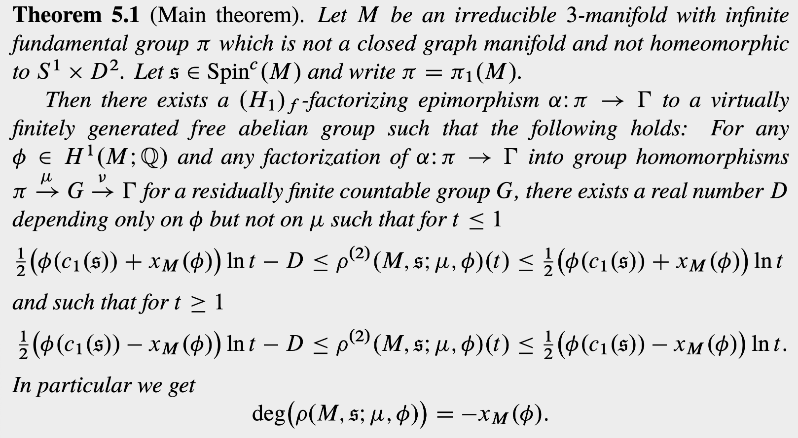

Let us first unravel what this theorem really means step by step.

## The manifold $M$

Lets inspect the first requirements:

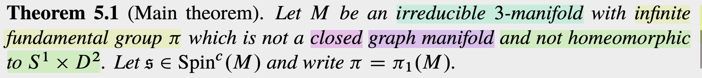

Further up in the text the authors specify that all manifolds are compact,
connected, and oriented, unless otherwise specified. So $M$ must be as well.

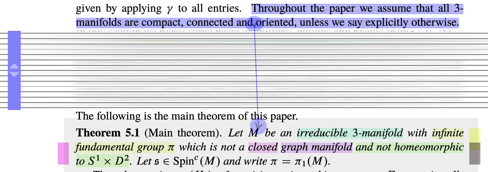

We will also assume like Friedl and Lück that all 3-manifolds are
compact, connected, and oriented, unless otherwise specified.

### Irreducible

We have a definition by Friedl in "AN INTRODUCTION TO 3-MANIFOLDS"

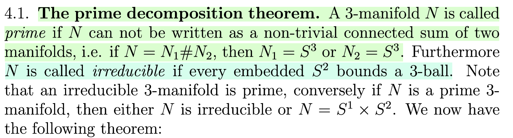

For this we need to define the connected sum of two 3-manifolds:

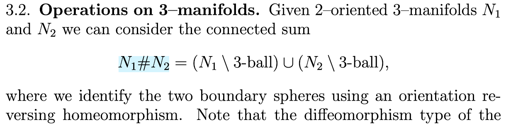

In the case of 2-manifolds, this video visualizes it well:



and for 3-manifolds (specifically $\mathbb{R}^3 \# \mathbb{R}^3$) this can be
seen as adding a wormhole between two copies of $\mathbb{R}^3$:



Or another way to look at this connected sum is by "cutting out" some region in
$N_1$ and "pasting" $N_2$ in there. We may even do this an infinite amount of
time in a checkerboard pattern, as shown here:



In this video the relevant section shows this infinite tiling where 3-manifolds
with different geometries are glued together in an alternating pattern:

:::{layout-ncol="2"}
](infinite-connected-sum-3-manifolds-tehora-rogue.png){group="screenshots" fig-align="left"}
:::

So being irreducible means either of the following equivalent conditions hold:
- every embedded $S^2$ of $M$ bounds a $D^3$.
- $M$ is prime ($M = N_1\# N_2 \implies N_1 = S^3 \text{ or }  N_2 = S^3$) or $M = S^1 \times S^2$.

### Infinite fundamental group

Aka. $\|\pi_1(M)\| = \infty$. We use this to apply the famous Thurston
geometrization theorem (these slides are from Lücks "Introduction to 3-manifolds" talk in Bonn):

:::{layout-ncol="2"}
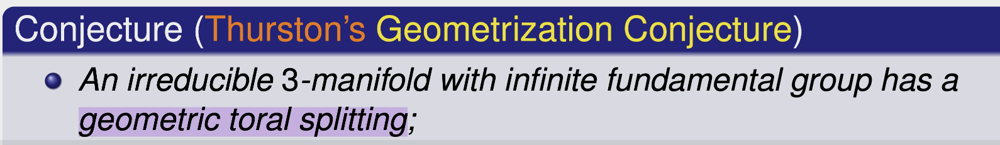{group="definitions" fig-align="left"}
:::

What is a "geometric toral splitting" you may ask?

:::{layout-ncol="2"}
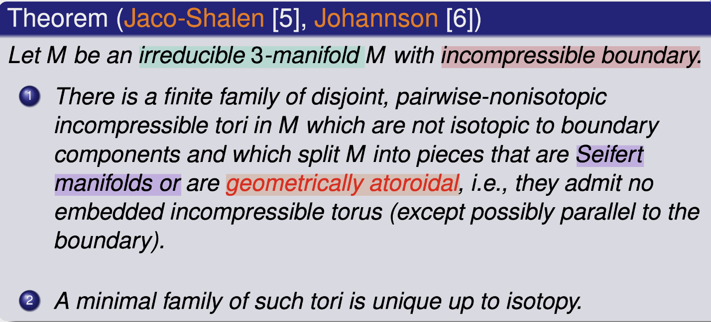{group="definitions" fig-align="left"}

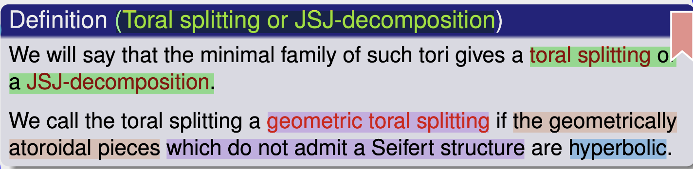{group="definitions" fig-align="left"}
:::

Here is a tool to play around this this definition (it only includes tori, and
no framed knots!):

<iframe width="560" height="315"
  src="https://happel.ai/jsjdecomp/"
  title="JSJDecomp" frameborder="0" allow="accelerometer;
  clipboard-write"
  allowfullscreen></iframe>

A surface $\iota : S \hookrightarrow M$ is _incompressible_, if it induces an injection
on the fundamental groups, i.e. $\pi_1(\iota) : \pi_1(S) \hookrightarrow \pi_1(M)$ is
injective. 

:::{layout-ncol="2"}
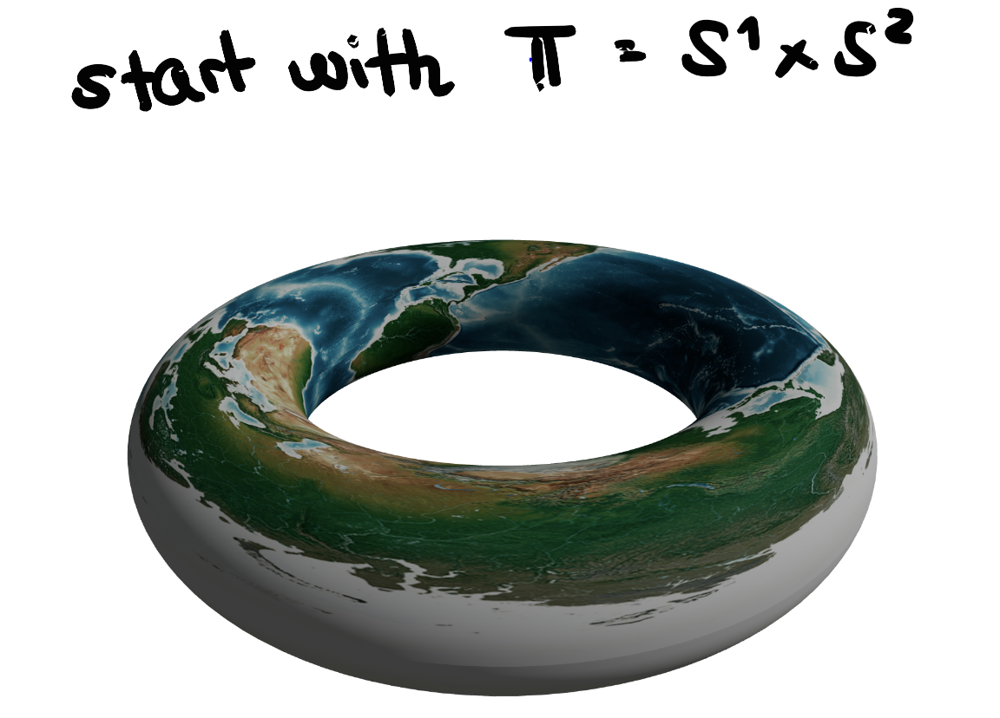{group="jsj-steps" fig-align="left"}
:::

What could cause $\pi_1(\iota)$ to fail at being injective? 
By the Hurewicz theorem, the first homology group $H_1(S)$ is the abelianization
of $\pi_1(S)$, but for $S$ a torus, $\pi_1(S) = \mathbb{Z}^2$ is already
abelian, so $H_1(S) = \pi_1(S)$. $H_1(S)$ is generated by the 
longitude and the
meridian
of the torus, so if either of those is sent to zero by $\pi_1$, then
$\pi_1(\iota)$ cannot be injective.

:::{layout-ncol="2"}
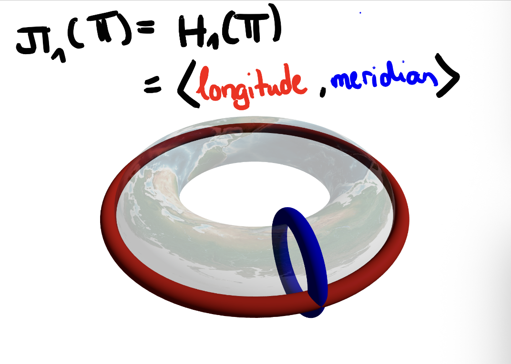{group="jsj-steps" fig-align="left"}
:::

Remember, that either of these loops will dissapear, if the ambient manifold $M$
contains a disk (a _compressing disk_), which will allow these loops to be
contracted to a point:

:::{layout-ncol="2"}
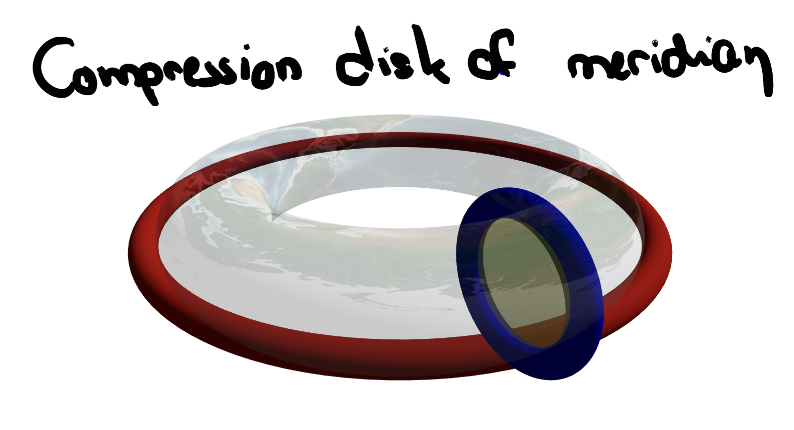{group="jsj-steps" fig-align="left"}

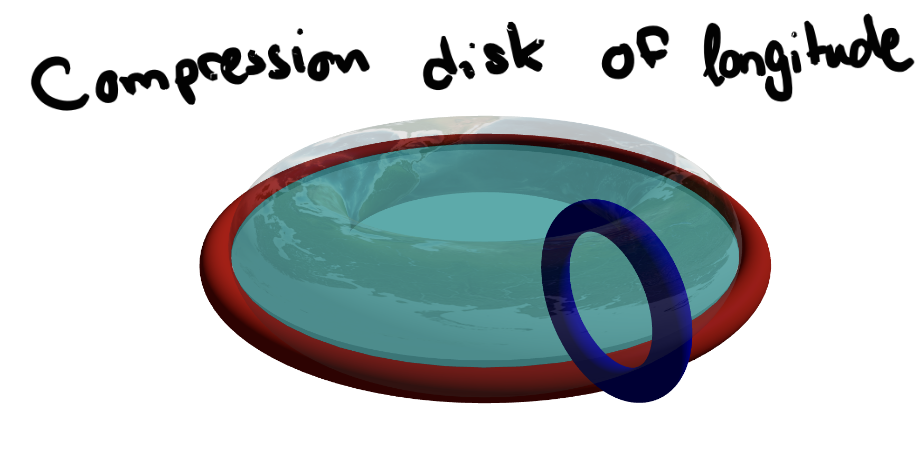{group="jsj-steps" fig-align="left"}
:::

Well, these disks cannot exist, iff $M$ contains some obstruction to prevent
such complressing disks.

:::{layout-ncol="2"}
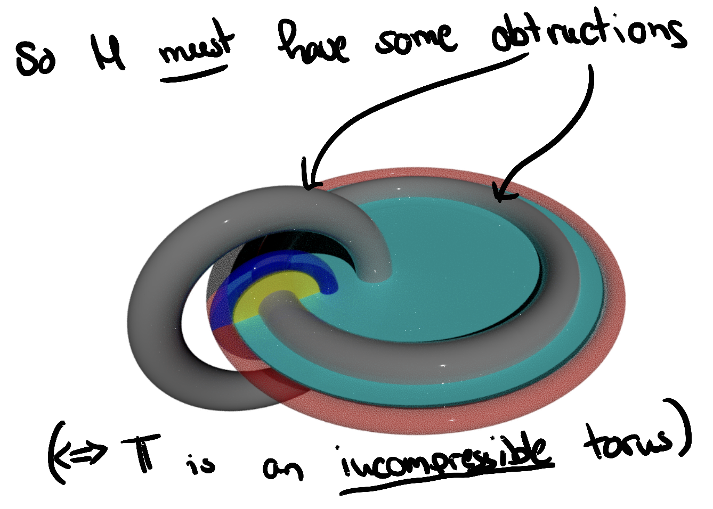{group="jsj-steps" fig-align="left"}
:::

This also explains what it means for $M$ to have "incompressible boundary":
$$
\pi_1(\partial M) \hookrightarrow \pi_1(M) \text{ is injective}
$$

This covers "disjoint" and "incompressible". What does it mean for a torus to
__not__ be __isotopic to a boundary component__?
Lets consider an example:

:::{layout-ncol="2"}
{group="jsj-steps" fig-align="center"}

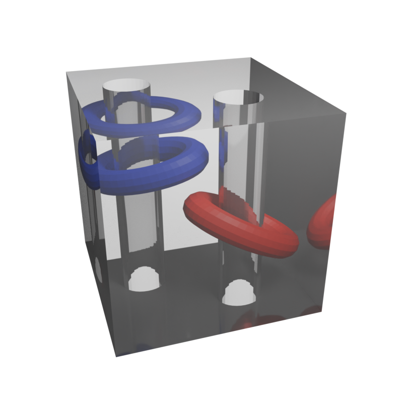{group="jsj-steps" fig-align="center"}

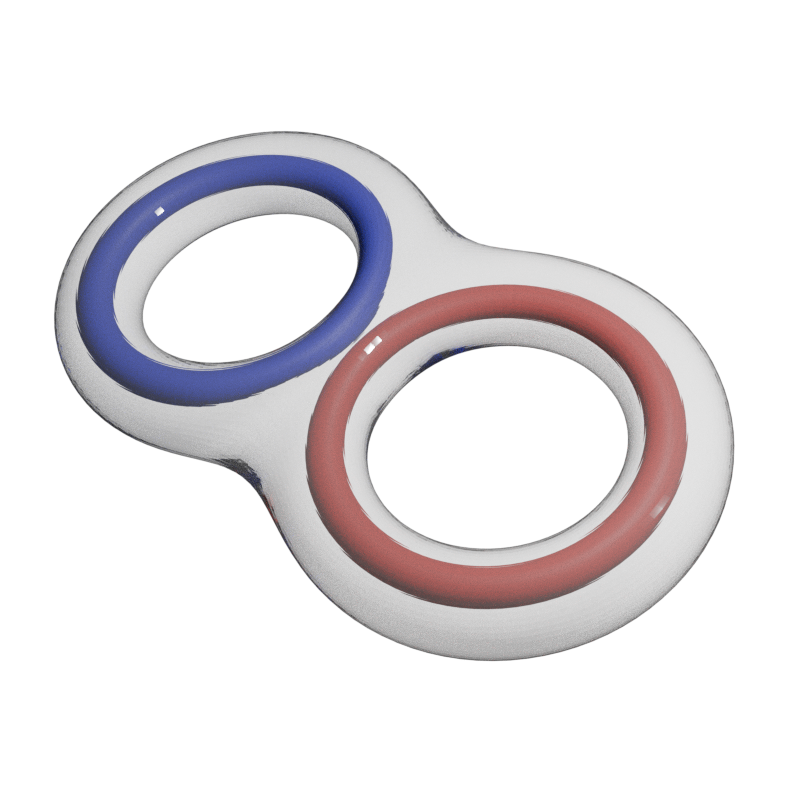{group="jsj-steps" fig-align="center"}

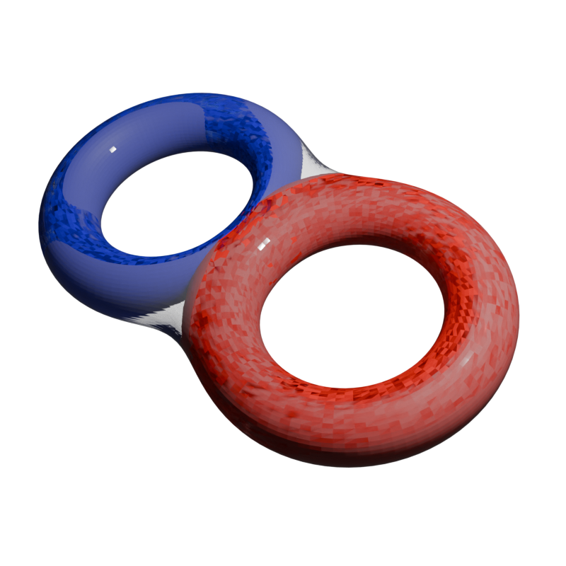{group="jsj-steps" fig-align="center"}
:::

As an example of a torus which is isotopic to a boundary component is given
here (for $\partial M \cong \mathbb{T}$)

:::{layout-ncol="2"}
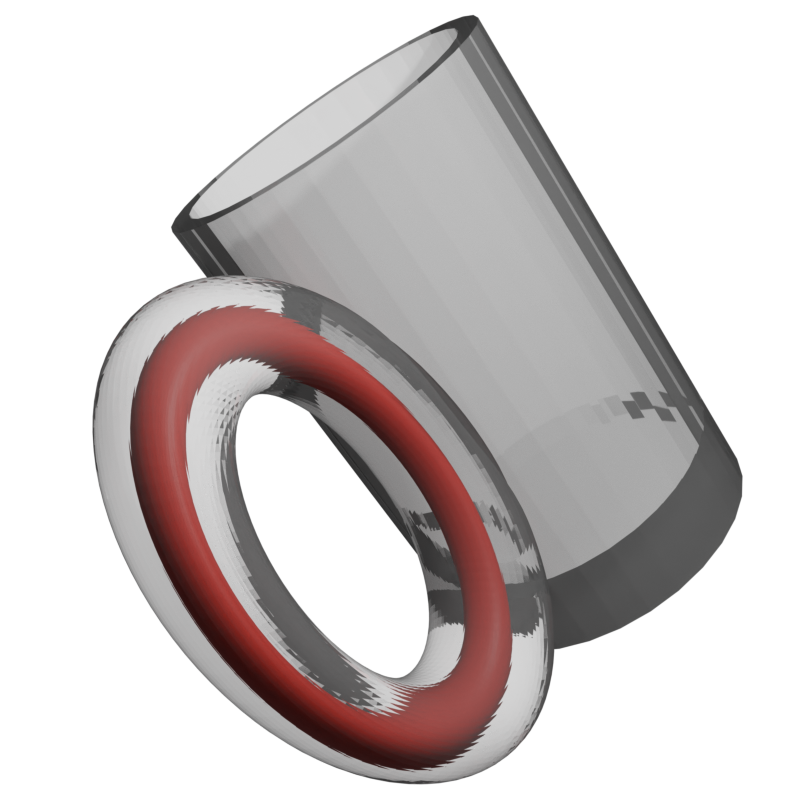{group="jsj-steps" fig-align="center"}
:::

#### Seifert manifolds

:::{layout-ncol="2"}
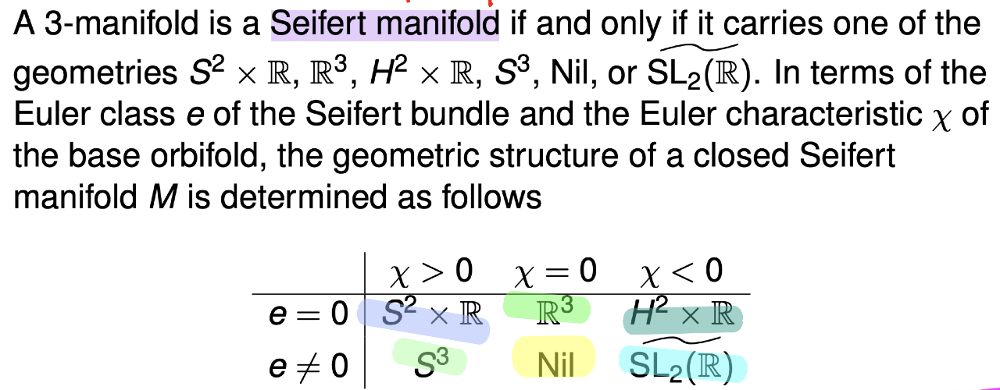{group="seifert-manifold" fig-align="center"}

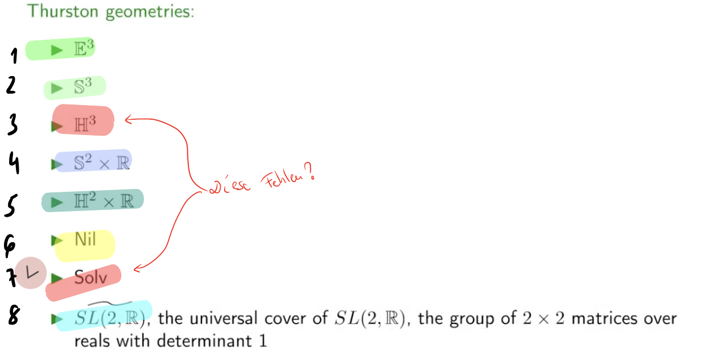{group="seifert-manifold" fig-align="center"}
:::

Specifically, these __are Seifert manifolds__:

:::{layout-ncol="3"}

](seifert/s2r.png){group="seifert-manifold" fig-align="center"}

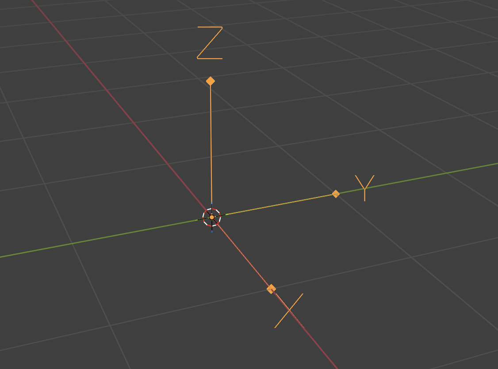{group="seifert-manifold" fig-align="center"}

](seifert/h2r.png){group="seifert-manifold" fig-align="center"}

](seifert/s3.png){group="seifert-manifold" fig-align="center"}

](seifert/nil.png){group="seifert-manifold" fig-align="center"}

](seifert/sl2r){group="seifert-manifold" fig-align="center"}
:::

and these are __not seifert manifolds__:

:::{layout-ncol="3"}
](not-seifert/h3.png){group="seifert-manifold" fig-align="center"}

](not-seifert/solv.png){group="seifert-manifold" fig-align="center"}
:::

#### geometrically atoroidal

### closed

A manifold without bounadary which is compact is called *closed*, so $M$ must
have **empty boundary**.

### Graph manifolds

By Wolfang Lück's talk as mentioned above, we have this definition:

:::{layout-ncol="2"}
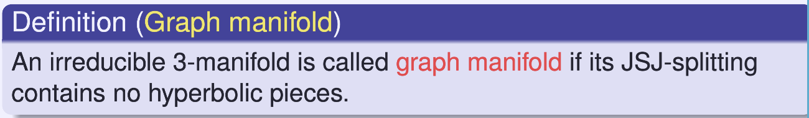{group="graph-manifold" fig-align="center"}

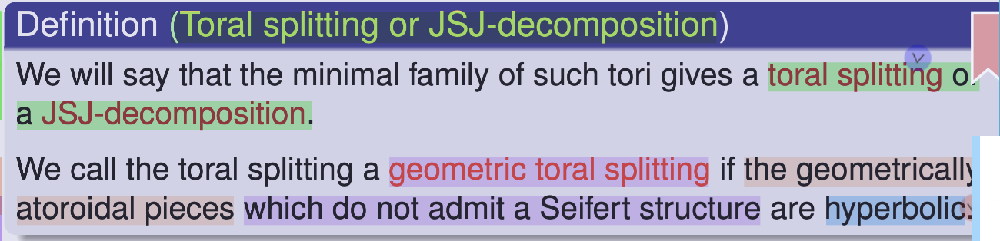{group="graph-manifold" fig-align="center"}
:::

And we have already inspected this under [infinite-fundamental-group](#infinite-fundamental-group)

### the spin structure $\mathfrak{s} \in \text{Spin}^c(M)$

We will not look too much into what this means. By Liu we know that omitting
this parameter in the function $\rho$ from the main theorem, we still obtain the
same asymptotic degree. In fact, omitting this parameter yields a family of
functions $[\rho] = \{\rho(t) \cdot t^r \mid \exists r \in \mathbb{R}\}$ 

This however does not change $\deg(\rho)$. For clarity though, we have

:::{layout-ncol="2"}
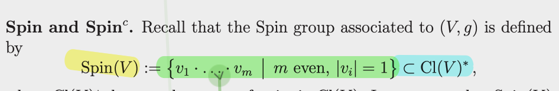{group="spin" fig-align="center"}

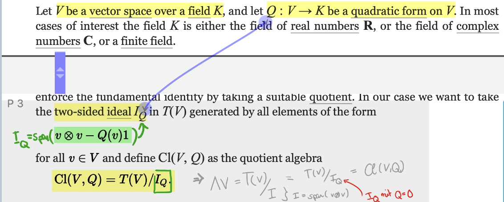{group="spin" fig-align="center"}

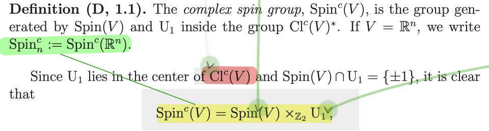{group="spin" fig-align="center"}

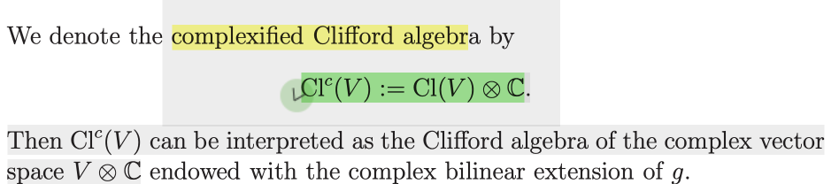

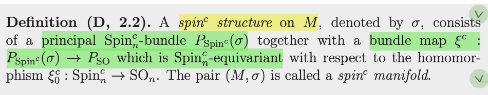
:::

Because $\text{Spin}^c(V)$ is the double cover of Lie groups[^double-cover] of 
$\text{SO}(V) \times U_1$, we can use these to describe spinor bundles.

[^double-cover]: The $L^2$-torsion function and the Thurston norm of 3-manifolds - Bohn - 2007 - An introduction to Seiberg-Witten theory on closed 3-manifolds.pdf, p158
