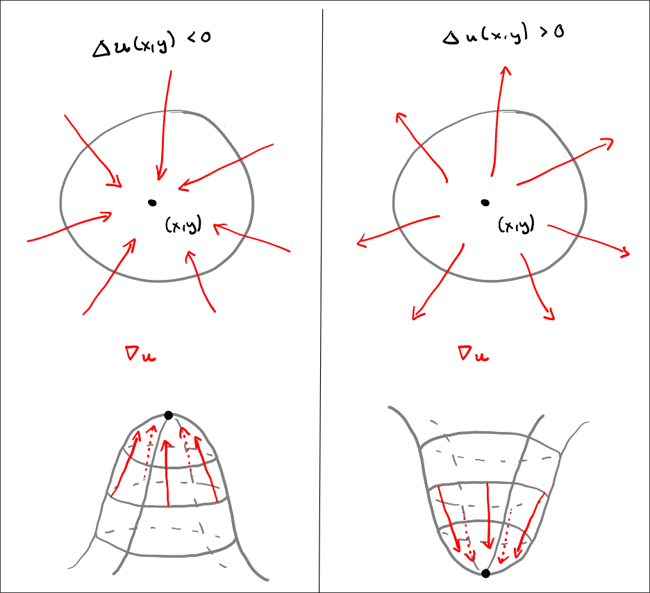

Assume you are given an [elliptic differential equaiton](https://en.wikipedia.org/wiki/Elliptic_partial_differential_equation)
possibly of the form:

$$
\begin{cases}
- \Delta u(x,y) &= f(x,y) & \forall (x,y) \in \Omega \\
u(x,y) &= g(x,y) & \forall (x,y) \in \partial \Omega
\end{cases}
$$

on the region $Omega = (0,1)^2$. In this case, we would deal with a poisson
equation. And lets say, we wish to model gravity. In 3D, this would mean that
$\Delta u = 4 \pi \rho$, where $\rho$ is our mass density function. Because we
are dealing with 2D here, we will not use the area of a sphere, but instead
use the area of a disk, so we replace $4 \pi$ by $2 \pi$. The mass density would
assign each point in our space $\Omega$ the mass which is located there. An
example could be the one one I plotted here:

<iframe src="https://www.desmos.com/3d/dcevrb5isv" width="100%" style="min-height:300px"></iframe> 

This would represent two objects at points $(0,0)$ and $(1,1)$ of different
sizes and with different masses.
Or, similarily, we could imagine $\Omega$ hosting a point-cloud of
particles. $\rho$ would then represent the amount of particles in a small region
around a given point (i.e. their _mass_).

$$\Delta u(x,y) = \left(\frac{ \partial^2 }{ \partial x^2 }u(x,y)\right)^2 + \left(\frac{ \partial^2 }{ \partial y^2 }u(x,y)\right)^2$$

or equivalently:

$$
\Delta u(x,y) = \nabla \cdot \nabla u(x,y)
$$

where $\nabla u(x,y)$ is the gradient vector field, associating to each point
in $\Omega$ the vector of steepest ascent and $\nabla \cdot$ takes in a vector
field and measures for each point how much, for a small region the vectors flow
out of it (the divergence). Together, this means that $\Delta u$ measures the
net outflow of the gradient field for each point:

- Positive Laplacian: Means the "uphill" vectors are generally pointing out 
  from the point (like an upside-down cone, a minimum).
- Negative Laplacian: Means the "uphill" vectors are generally pointing in 
  toward the point (like a normal hill, a maximum).


So $- \Delta u(x,y) = f(x,y) \forall (x,y) \in \Omega$ means the higher $f(x,y)$ is,
the more negative $-\Delta u(x)$ is, and therefor more points near $(x,y)$ are
attracted to it. This is exactly what we would expect from gravitational force!
We may see this more clearly, be pushing the signs around: 
$\Delta u(x,y) = - f(x,y) \forall (x,y) \in \Omega$

It might be a good idea to also visualize our mirrored $f$:

<iframe src="https://www.desmos.com/3d/3jewa9gusw" width="100%" style="min-height:300px"></iframe> 

And this might look familiar to an experiment intended to explain gravity, which
I assume most have already seen:

<iframe width="560" height="315" src="https://www.youtube.com/embed/MTY1Kje0yLg?si=GYK5YN2Hgvft0cyZ" title="YouTube video player" frameborder="0" allow="accelerometer; autoplay; clipboard-write; encrypted-media; gyroscope; picture-in-picture; web-share" referrerpolicy="strict-origin-when-cross-origin" allowfullscreen></iframe>



The influx in the above picture is represented by the laplacian $\Delta u$.
The gray space around the point $(x,y)$ would then be the other values which $u$
takes on in a neighborhood around $(x,y)$.

---

How can we find $u$ given the above poisson equation?

We will calculate the solution approximately on a grid

```{python}
import numpy as np
import plotly.graph_objects as go

# Parameters
N = 10
h = 1 / (N + 1)

# Unit square in (x,y) plane
square = ([0, 1, 1, 0, 0], [0, 0, 1, 1, 0], [0]*5)

# Interior grid points (blue)
grid_x = [i*h for i in range(1, N+1) for j in range(1, N+1)]
grid_y = [j*h for i in range(1, N+1) for j in range(1, N+1)]
grid_z = [0] * len(grid_x)

# Boundary points (red)
boundary = [(x,y,z) 
  for (x,i) in [ (i*h,i) for i in range(N+2) ] 
  for (y,j) in [ (i*h,i) for i in range(N+2) ] 
  for z in [0]
  if i == 0 or j == 0 or i == N+1 or j == N+1
]

# Create figure
fig = go.Figure()

# Add unit square, interior grid points, and boundary points
fig.add_trace(go.Scatter3d(x=square[0], y=square[1], z=square[2], mode='lines',
                           line=dict(color='black', width=4), name='Unit Square'))
fig.add_trace(go.Scatter3d(x=grid_x, y=grid_y, z=grid_z, mode='markers',
                           marker=dict(size=5, color='blue'), name=f'Interior (N={N})'))
fig.add_trace(go.Scatter3d(
  x=[v[0] for v in boundary],
  y=[v[1] for v in boundary],
  z=[v[2] for v in boundary],
  mode='markers',
  marker=dict(size=5, color='red'),
  name='Boundary'))

# Update layout
fig.update_layout(
    title=f'Unit Square in (x,y) Plane with Grid Points (N={N}, h={h:.4f})',
    scene=dict(xaxis_title='X', yaxis_title='Y', zaxis_title='Z', aspectmode='cube'),
    showlegend=True, width=800, height=800
)

fig.show()
```

::: {.callout-warning}
This is where I stopped and I made no further progess. I would have liked to
introduce the finite element method here though, which would have resulted in a
sparse system of linear equations, whose solution would result in an approximate
solution of our elliptic partial differential equation.
This would have relied on the Lax-Milgram theorem, which allows writing
differential equations of order 2 in a weak form, which results in an equation
only of order 1.
:::
